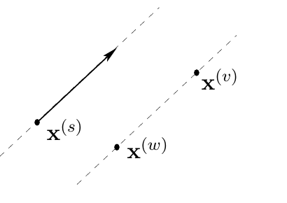

<!-- 原书 PDF 物理页 410；印刷页 398。含习题 30.12 及无编号插图、30.9 解答、式 (30.16)–(30.18)；本章终页。 -->

习题 30.12。（难度 4）研究一种用于切片采样的多状态方法。像 Skilling 的多状态蛙跳方法（第 30.4 节）一样，维持一组 $S$ 个状态向量 $\{\mathbf x^{(s)}\}$。每次选出一个状态向量 $\mathbf x^{(s)}$，沿方向 $\mathbf y$ 对它进行一维切片采样更新；随机选取另外两个状态向量 $\mathbf x^{(v)}$ 和 $\mathbf x^{(w)}$，令 $\mathbf y=\mathbf x^{(v)}-\mathbf x^{(w)}$，从而确定这个方向。请在高度相关的多变量高斯分布等简单问题上研究此方法。注意，如果 $S-1$ 小于维数 $N$，这种方法本身就不具有遍历性，因此可能需要与其他方法混合使用。是否有某些类别的问题，比起沿坐标轴依次更新，或从高斯分布中随机抽取 $\mathbf u$ 等标准选取方向 $\mathbf y$ 的方法，用这种切片采样方法能解决得更好？

**图内标记译注（原书无图号）。** $\mathbf x^{(s)}$ 为待更新的状态，$\mathbf x^{(v)}$ 与 $\mathbf x^{(w)}$ 为另外两个随机选取的状态；它们的差确定方向 $\mathbf y$。实线箭头表示沿该方向的更新，虚线表示方向相同的直线。

## 30.9　解答

**习题 30.3 的解答**（印刷页 393）。考虑各分量均值为零、方差为 1 的球形高斯分布。在一维情形下，若第 $n$ 个分量 $x_n^{(1)}$ 蛙跳过 $x_n^{(2)}$，则提出的坐标为

$$\bigl(x_n^{(1)}\bigr)'=2x_n^{(2)}-x_n^{(1)}.\tag{30.16}$$

设 $x_n^{(1)}$ 和 $x_n^{(2)}$ 都是来自 $\operatorname{Normal}(0,1)$ 的高斯随机变量，那么 $\bigl(x_n^{(1)}\bigr)'$ 服从 $\operatorname{Normal}(0,\sigma^2)$，其中 $\sigma^2=2^2+(-1)^2=5$。这一维所贡献的能量变化为

$$\frac12\left[\bigl(2x_n^{(2)}-x_n^{(1)}\bigr)^2-\bigl(x_n^{(1)}\bigr)^2\right]=2\bigl(x_n^{(2)}\bigr)^2-2x_n^{(2)}x_n^{(1)}.\tag{30.17}$$

因此，典型的能量变化为 $2\langle(x_n^{(2)})^2\rangle=2$。这是一条坏消息。对于 $N$ 维，在平衡状态下进行一次蛙跳，典型的能量变化为 $+2N$。这次移动被接受的概率按以下规律缩放：

$$e^{-2N}.\tag{30.18}$$

这意味着，照上述方式使用 Skilling 方法，在很高维的问题中并不有效——至少在已经收敛之后是如此。不过，它还有一个突出的优点：收敛性质与变量之间相关性的强度无关。哈密顿蒙特卡罗和过松弛方法都不具备这一性质。
