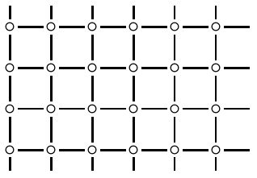
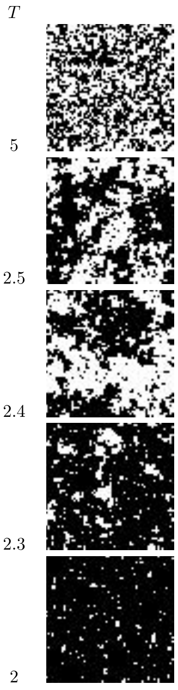

<!-- 原书 PDF 物理页 415；印刷页 403。含图 31.1、31.2，式 (31.21)，无编号斜体小标题。 -->

这种方法接受能量上不利的移动的概率大约高出一倍，因此采样效率可能更高；不过，在很低的温度下，Gibbs 采样与 Metropolis 算法的相对优劣可能相当微妙。

### *矩形几何结构*

**图 31.1。** 矩形 Ising 模型。图中的圆圈表示自旋，连线表示近邻关系。

我首先模拟图 31.1 所示的矩形几何结构，并采用周期边界条件。两自旋之间有连线，就表示它们互为近邻。把外加场设为 $H=0$，分别考察 $J=+1$ 和 $J=-1$，即铁磁和反铁磁两种情形。

我从较高温度（$T=33,\ \beta=0.03$）开始，每经过 $I$ 次迭代就改变一次温度：先逐渐降至 $T=0.1,\ \beta=10$，再逐渐升回高温。这样可以粗略检查每个温度下是否“已达到平衡”：如果没有，画出的曲线预计会出现滞后现象。它还可以让我们大致了解结果是否可重复，只要假设降温与升温两次运行实际上彼此独立。

**图 31.2。** $J=1$ 的矩形 Ising 模型在一系列温度 $T$ 下的样本状态。图内温度由上至下依次为 $5$、$2.5$、$2.4$、$2.3$、$2$；黑白格对应两种自旋状态。

在每个温度下，我记录了每个自旋的平均能量、能量的标准差，以及磁化强度 $m$ 的平方的平均值，其中

$$m=\frac1N\sum_n x_n.\tag{31.21}$$

一个棘手的决定是：设定新温度后，何时开始测量？我们很难检测系统是否“已达到平衡”，甚至很难给“处于平衡”一个明确的定义！［不过，在第 32 章我们会看到解决这一问题的方法。］我采用的粗略策略是：每个温度下迭代 $I$ 次，让 $I$ 达到自旋数 $N$ 的几百倍，并丢弃前 $1/3$ 次迭代。对于 $N=100$，我发现每个给定温度下都需要超过 $100\,000$ 次迭代才能达到平衡。

### *小规模 $N$、$J=1$ 时的结果*

我模拟了一个 $l\times l$ 网格，其中 $l=4,5,\ldots,10,40,64$。先想想我们预期会得到什么结果。低温时，系统预计处于基态。$J=1$ 的矩形 Ising 模型有两个基态：全部自旋为 $+1$，或全部为 $-1$。任一基态中，每个自旋的能量都是 $-2$。高温时，自旋彼此独立，所有状态等概率，能量预计围绕平均值 $0$ 波动，其标准差与 $1/\sqrt N$ 成正比。

现在来看一些结果。在所有图中，温度 $T$ 都取 $k_{\rm B}=1$。仅用 16 个自旋（图 31.3 上排），基本的趋势已经显现：能量随温度单调上升。将自旋数增至 100（图 31.3 下排）后，又能看出一些细节。首先，正如预期，高温下的涨落按 $1/\sqrt N$ 减小。其次，中等温度下的涨落相对变得*更大*。这是“集体现象”的标志；这里它是一种相变。只有 $N$ 无穷大时，系统才有真正的相变；不过，$N=100$ 已显出临界涨落的迹象。图 31.5 详细展示 $N=100$ 和 $N=4096$ 的曲线。图 31.2 展示模拟 $N=4096$ 个自旋时，温度逐步降低所得的一系列典型状态。
