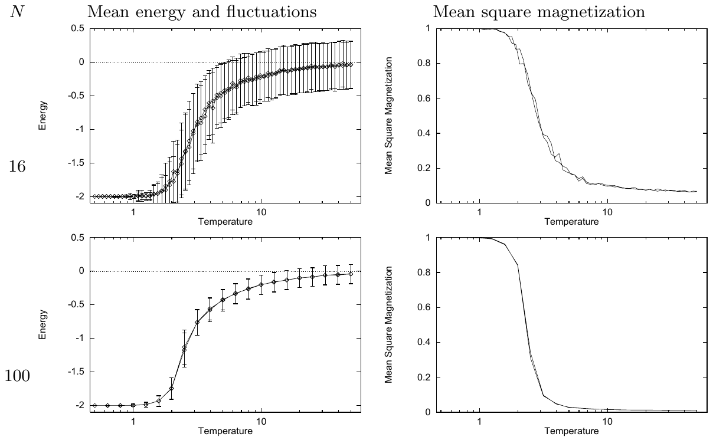
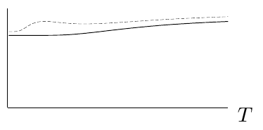

<!-- 原书 PDF 物理页 416；印刷页 404。含图 31.3、31.4，式 (31.22)–(31.24)。末段跨越纯图页 PDF417 至 PDF418，在本页合成完整段落。 -->

**图 31.3。** $J=1$ 的矩形 Ising 模型的蒙特卡罗模拟结果。左列：平均能量及能量涨落随温度的变化；右列：平均平方磁化强度随温度的变化。上排 $N=16$，下排 $N=100$；更大的 $N$ 见后续图。图内英文“Mean energy and fluctuations”“Mean square magnetization”“Energy”“Temperature”“Mean Square Magnetization”分别为“平均能量与涨落”“平均平方磁化强度”“能量”“温度”“平均平方磁化强度”。

### *与 Schottky 异常对比*

凡是能级数有限的系统，热容随温度变化的曲线上都会有峰；峰本身并不能证明发生了相变。在经典热力学中，这样的峰曾被视为异常，因为具有无限多个能级的“普通”系统（例如盒子中的粒子），其热容要么恒定，要么随温度升高而增加。与之相反，能级数有限的系统会使热容曲线出现小凸起（图 31.4）。

**图 31.4。** Schottky 异常的示意图。两条曲线表示两种气体的热容随温度 $T$ 的变化。下方曲线是一种热容随温度升高而增加的普通气体；上方曲线的热容多了一个小峰，称为 Schottky 异常（至少在剑桥如此称呼）。这个峰来自气体中只有有限个可达状态的磁性自由度。图内横轴 $T$ 表示温度。

先回顾最简单的这种系统：它有两个能级，$x=0$ 对应能量 $0$，$x=1$ 对应能量 $\epsilon$。平均能量是

$$E(\beta)=\epsilon\frac{\exp(-\beta\epsilon)}{1+\exp(-\beta\epsilon)}=\epsilon\frac{1}{1+\exp(\beta\epsilon)},\tag{31.22}$$

它对 $\beta$ 的导数为

$$\frac{\mathrm dE}{\mathrm d\beta}=-\epsilon^2\frac{\exp(\beta\epsilon)}{[1+\exp(\beta\epsilon)]^2}.\tag{31.23}$$

所以热容是

$$C=\frac{\mathrm dE}{\mathrm dT}=-\frac{\mathrm dE}{\mathrm d\beta}\frac1{k_{\rm B}T^2}=\frac{\epsilon^2}{k_{\rm B}T^2}\frac{\exp(\beta\epsilon)}{[1+\exp(\beta\epsilon)]^2}\tag{31.24}$$

能量涨落则由 $\operatorname{var}(E)=Ck_{\rm B}T^2=-\mathrm dE/\mathrm d\beta$ 给出，其值已在式 (31.23) 算出。图 31.6 画出了热容和涨落。这里要记住的是：Schottky 异常的热容虽然有峰，其*涨落却没有峰*；能量方差只会随温度单调增加，直到达到一个与独立自旋数成正比的值。因此，值得关注的是*涨落*中的峰，而不是热容中的峰。Ising 模型确实有这样的涨落峰，图 31.5 的第二排就显示了它。

### *$J=-1$ 的矩形 Ising 模型*

当 $J=-1$ 时，我们预计会发生什么？无限系统的基态是两种棋盘格图案（图 31.7），它们同 $J=1$ 模型的基态一样，每个自旋的能量都是 $-2$。这种类比能否再推进一步？稍加思考便能发现，两个系统通过棋盘格对称操作彼此等价。取一个处于任意状态的无限大 $J=1$ 系统，翻转无限棋盘格黑格上的所有自旋，再把 $J$ 设为 $-1$（图 31.8），能量便保持不变。［当然，磁化强度会改变。］因此，在外加场为零时，预计两个系统的所有热力学性质都相同。
