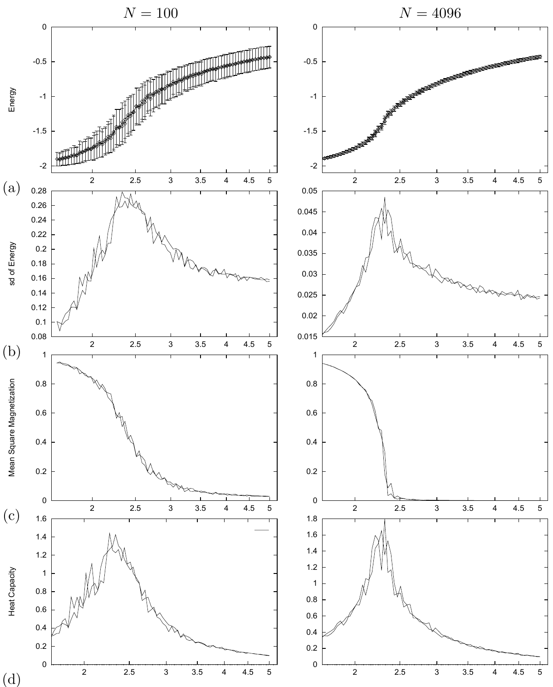
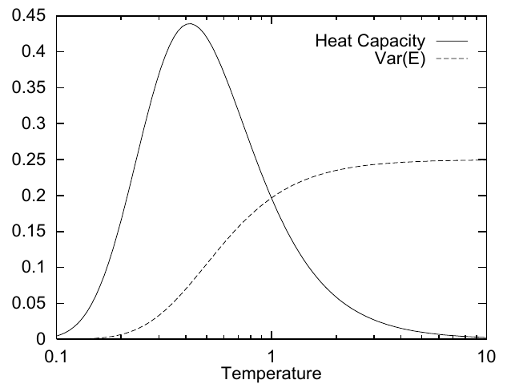

<!-- 原书 PDF 物理页 417；印刷页 405。整页为图 31.5 和图 31.6 及其图注；PDF416 末段续句在 PDF418，已于 PDF416 译稿合段。 -->

**图 31.5。** $J=1$ 的矩形 Ising 模型的蒙特卡罗模拟细节。左列 $N=100$，右列 $N=4096$。（a）平均能量及能量涨落随温度变化；（b）能量涨落（标准差）；（c）平均平方磁化强度；（d）热容。图内英文“Energy”“sd of Energy”“Mean Square Magnetization”“Heat Capacity”分别为“能量”“能量标准差”“平均平方磁化强度”“热容”，各横轴均为温度。

**图 31.6。** Schottky 异常：能级间隔 $\epsilon=1$、$k_{\rm B}=1$ 的两能级系统，其热容和能量涨落随温度的变化。图内英文“Heat Capacity”“Var(E)”“Temperature”分别为“热容”“能量方差”“温度”；实线表示热容，虚线表示能量方差。
