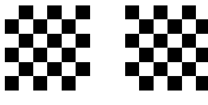
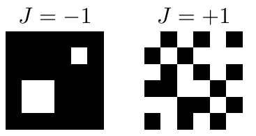
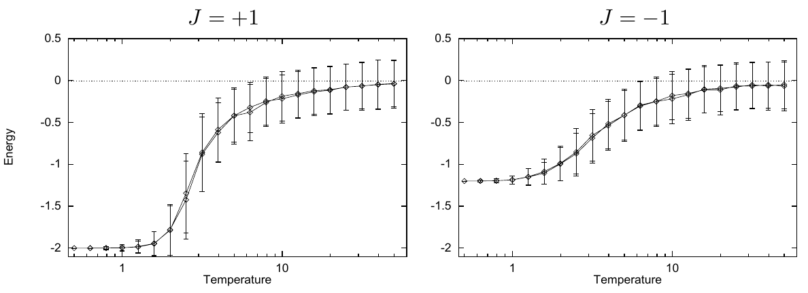
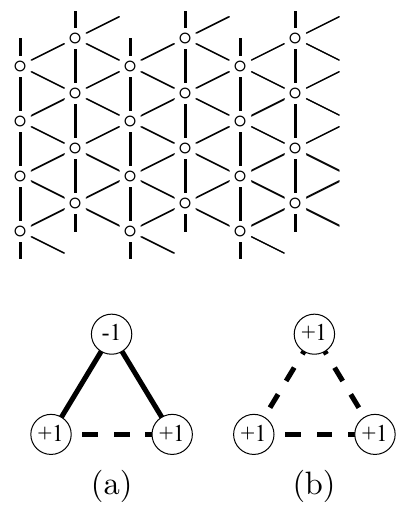

<!-- 原书 PDF 物理页 418；印刷页 406。页首为 PDF416 跨越纯图页 PDF417 的续段，已合入 PDF416。本页含图 31.7–31.10、三角网格小标题及完整图注。 -->

不过，这里有一个不易察觉的细节。你注意到了吗？我们模拟的是采用周期边界条件的有限网格。如果网格在任一方向的长度为*奇数*，棋盘格操作就不再是把 $J=+1$ 与 $J=-1$ 联系起来的对称操作，因为棋盘图案在边界处无法接上。这意味着，对于奇数大小的系统，$J=-1$ 的基态简并度大于 2，而且这些基态的能量也不会低至每个自旋 $-2$。因此，我们预期奇数大小的系统在 $J=\pm1$ 两种情形下会有定性差异。这些差异在小系统中预计最明显。边界引入了阻挫（frustration），而边界长度按系统大小的平方根增长，所以与边界阻挫有关的影响，在系统能量和熵中所占比例会按 $1/\sqrt N$ 减小。图 31.9 比较了 $N=25$ 时铁磁和反铁磁模型的能量；两者差异十分明显。

**图 31.7。** $J=-1$ 的矩形 Ising 模型的两个基态；图中两种黑白棋盘格互为自旋翻转。

**图 31.8。** $J=\pm1$ 的矩形 Ising 模型中能量相同的两种状态。图内左、右标题分别是 $J=-1$ 和 $J=+1$。

**图 31.9。** $J=\pm1$、$N=25$ 的矩形 Ising 模型的蒙特卡罗模拟：平均能量和能量涨落随温度的变化。图内左、右标题分别是 $J=+1$ 和 $J=-1$；“Energy”“Temperature”分别为“能量”“温度”。

### *三角网格 Ising 模型*

我们也可以对三角网格 Ising 模型重复这些计算。$J=\pm1$ 时，三角网格模型的物理性质是否会与矩形模型不同？$J=1$ 的模型大体应与对应的矩形模型有相似性质。但 $J=-1$ 的情形与前面截然不同。想一想：这里*不存在无阻挫的基态*；无论处于哪种状态，*总会有阻挫*——有些近邻自旋的符号相同。与奇数大小的矩形网格不同，这里的阻挫并非周期边界条件引入。正如图 31.10 所示，*每组三个两两相邻的自旋都必然处于阻挫状态*。［实线表示“满意”的耦合，对能量贡献 $-|J|$；虚线表示“不满意”的耦合，对能量贡献 $|J|$。］因此，我们显然预计低温行为会不同。实际上，我们甚至可能预期这个系统在绝对零度仍有非零熵。［三角网格模型违反热力学第三定律！］

**图 31.10。** 在反铁磁三角网格 Ising 模型中，任意三个两两相邻的自旋都会出现阻挫。三自旋的八种可能构型中，有六种的能量为 $-|J|$（a），另两种为 $3|J|$（b）。图内圆圈中的 $+1$、$-1$ 是自旋状态；实线与虚线的含义如正文所述。

来看一些结果。图 31.12 给出样本状态，图 31.11 给出 $N=4096$ 时的能量、涨落和热容。
