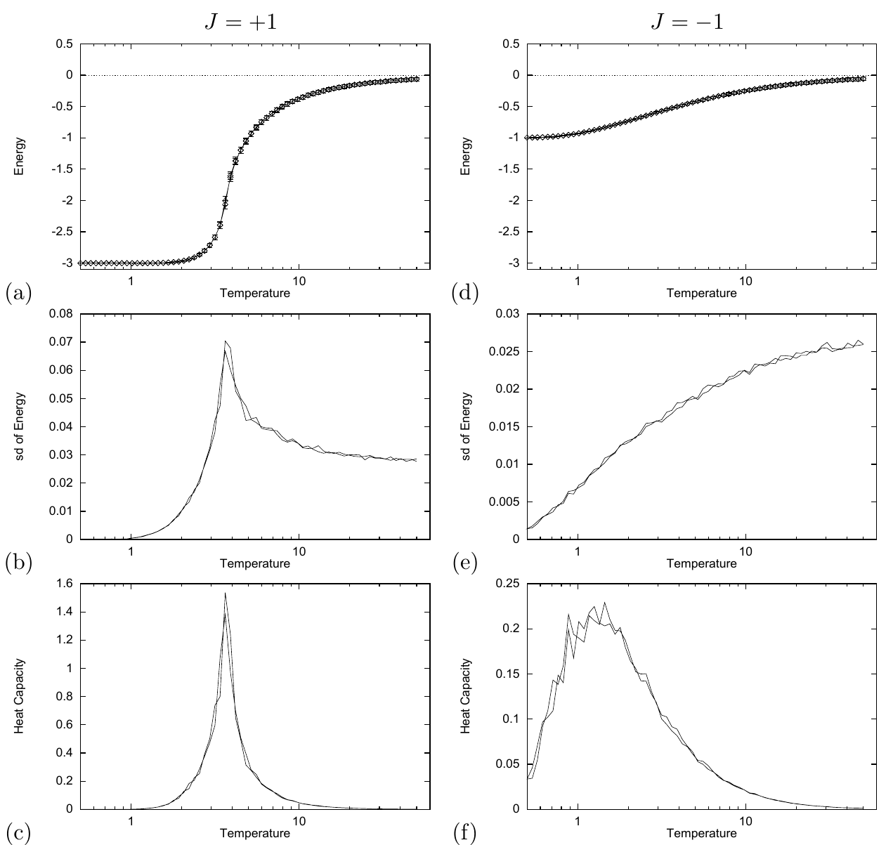

<!-- 原书 PDF 物理页 419；印刷页 407。含图 31.11、31.2 节开头和式 (31.25)。末段跨越纯图页 PDF420 至 PDF421，已在本页合为完整段落。 -->

注意 $J=\pm1$ 的结果有多么不同。$J=-1$ 时，能量的标准差完全没有峰。这表明反铁磁系统没有相变到具有长程有序的状态。

**图 31.11。** $N=4096$、$J=\pm1$ 的三角网格 Ising 模型的蒙特卡罗模拟。左列（a–c）为 $J=1$，右列（d–f）为 $J=-1$。（a、d）平均能量及能量涨落随温度的变化；（b、e）能量涨落（标准差）；（c、f）热容。图内英文“Energy”“sd of Energy”“Heat Capacity”“Temperature”分别为“能量”“能量标准差”“热容”“温度”。

## 31.2　直接计算 Ising 模型的配分函数

现在来看研究 Ising 模型的一种完全不同的方法。*转移矩阵方法*是一种精确且抽象的方法：它从配分函数求出模型的物理性质，配分函数为

$$Z(\beta,\mathbf J,\mathbf b)\equiv\sum_{\mathbf x}\exp[-\beta E(\mathbf x;\mathbf J,\mathbf b)],\tag{31.25}$$

其中，求和遍及所有状态 $\mathbf x$，逆温度为 $\beta=1/T$。［照惯例，令 $k_{\rm B}=1$。］自由能为 $F=-\frac1\beta\ln Z$。状态数为 $2^N$，所以当 $N$ 很大时，无法直接计算配分函数。为避免显式枚举所有整体状态，我们可以使用一个类似第 25 章和积算法的技巧。我们集中研究宽度为 $W$、两个方向都采用周期边界条件的狭长条带模型，沿条带的长度方向迭代：利用位置 $l-1$ 处的一组部分配分函数，算出位置 $l$ 处的部分配分函数。每次迭代都要对边界上的全部状态求和，所以运算量随条带宽度 $W$ 呈指数增长。最后一个巧妙技巧是注意到：若系统沿长度方向具有平移不变性，就只需做一次迭代，便能求出*任意*长度的系统的性质。
