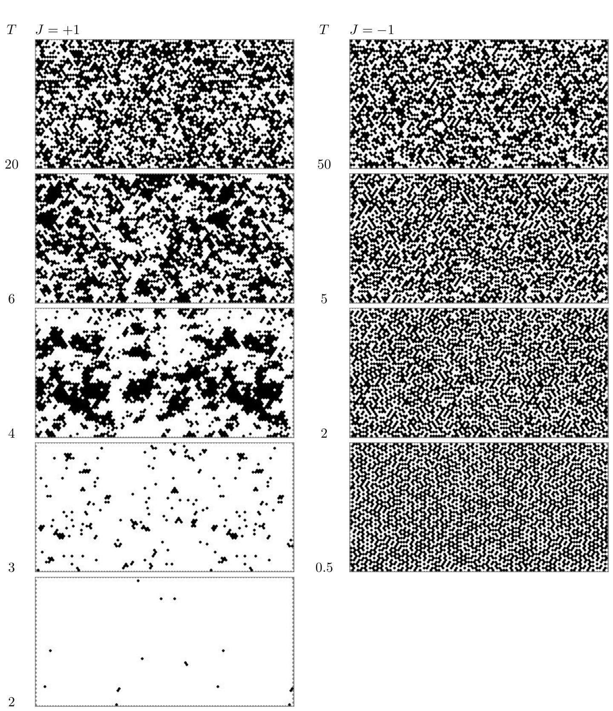

<!-- 原书 PDF 物理页 420；印刷页 408。整页为图 31.12 及图注；PDF419 的跨页段落续于 PDF421，已在 PDF419 合段。 -->

**图 31.12。** $J=1$ 与 $J=-1$ 两种三角网格 Ising 模型的样本状态。上方是高温，下方是低温。图内左列标题 $J=+1$，由上至下的温度 $T$ 为 $20$、$6$、$4$、$3$、$2$；右列标题 $J=-1$，温度为 $50$、$5$、$2$、$0.5$。黑白格表示两种自旋状态。
