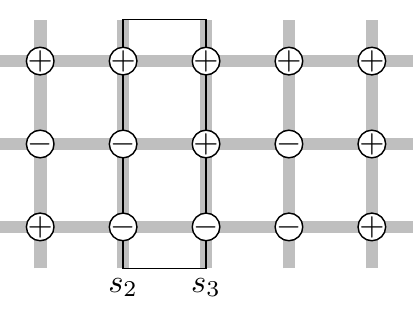

<!-- 原书 PDF 物理页 421；印刷页 409。页首是 PDF419 跨越纯图页 PDF420 的续句，已合入 PDF419。本页含图 31.13、式 (31.26)–(31.34)、斜体小标题。式 (31.28) 照原书印刷保留符号，疑点另记。 -->

计算任务变成求一个 $S\times S$ 矩阵及其特征值，其中 $S$ 是边界上需要考虑的微观状态数。绝对值最大的特征值，给出无限长狭窄条带的配分函数。

下面详细解释。把条带的 $C$ 列状态标记为 $s_1,s_2,\ldots,s_C$，每个 $s_c$ 都是从 $0$ 到 $2^W-1$ 的整数。$s_c$ 的第 $r$ 个比特表示第 $r$ 行、第 $c$ 列的自旋朝上还是朝下。配分函数为

$$Z=\sum_{\mathbf x}\exp(-\beta E(\mathbf x))\tag{31.26}$$

$$=\sum_{s_1}\sum_{s_2}\cdots\sum_{s_C}\exp\left(-\beta\sum_{c=1}^{C}\mathcal E(s_c,s_{c+1})\right),\tag{31.27}$$

其中 $\mathcal E(s_c,s_{c+1})$ 是适当定义的能量；若要采用周期边界条件，则定义 $s_{C+1}=s_1$。$\mathcal E$ 的一种定义是：

$$\begin{aligned}\mathcal E(s_c,s_{c+1})={}&\sum_{\substack{(m,n)\in\mathcal N:\\m\in c,\,n\in c+1}}Jx_mx_n\\&+\frac14\sum_{\substack{(m,n)\in\mathcal N:\\m\in c,\,n\in c}}Jx_mx_n\\&+\frac14\sum_{\substack{(m,n)\in\mathcal N:\\m\in c+1,\,n\in c+1}}Jx_mx_n.\end{aligned}\tag{31.28}$$

**图 31.13。** 说明式 (31.28) 的定义。$\mathcal E(s_2,s_3)$ 计入图中矩形里的全部能量贡献；让这个矩形沿条带移动，就得到总能量。矩形内的每条水平连线计数一次；每条竖直连线有一半位于矩形内，另一半将在相邻矩形内，因此其一半能量计入 $\mathcal E(s_2,s_3)$。式 (31.28) 第二项出现 $1/4$，是因为 $m$、$n$ 都遍历第 $c$ 列的所有节点，每条连线会被访问两次。图示状态下，$s_2=(100)_2$，$s_3=(110)_2$：若上下采用周期边界条件，水平连线对 $\mathcal E(s_2,s_3)$ 贡献 $+J$，左侧竖直连线贡献 $-J/2$，右侧竖直连线贡献 $-J/2$，因此 $\mathcal E(s_2,s_3)=0$。图中标记 $s_2,s_3$ 为相邻两列状态，圆圈中的 $+/-$ 为自旋符号，灰色矩形划定本次计能区域。

这个能量定义有一个方便的性质：对于矩形 Ising 模型，它定义的矩阵在两个下标 $s_c,s_{c+1}$ 上是对称的。竖直连线的计数总共出现四次，所以需要 $1/4$ 因子。定义

$$M_{ss'}\equiv\exp[-\beta\mathcal E(s,s')].\tag{31.29}$$

接着沿用式 (31.27)，

$$Z=\sum_{s_1}\sum_{s_2}\cdots\sum_{s_C}\left[\prod_{c=1}^{C}M_{s_c,s_{c+1}}\right]\tag{31.30}$$

$$=\operatorname{Trace}[\mathbf M^C]\tag{31.31}$$

$$=\sum_a\mu_a^C,\tag{31.32}$$

其中 $\{\mu_a\}_{a=1}^{2^W}$ 是 $\mathbf M$ 的特征值。随着条带长度 $C$ 增大，$Z$ 逐渐由最大特征值 $\mu_{\max}$ 主导：

$$Z\to\mu_{\max}^{C}.\tag{31.33}$$

所以，对于无限长的狭窄条带，每个自旋的自由能为

$$f=-kT\ln Z/(WC)=-kTC\ln\mu_{\max}/(WC)=-kT\ln\mu_{\max}/W.\tag{31.34}$$

真令人赞叹：一条狭长条带的*全部*热力学性质，只需这个矩阵 $\mathbf M$ 的最大特征值就能求出！

### *计算*

我计算了图 31.14 所示的*狭长条带* Ising 模型的配分函数。

和上一节一样，我把外加场 $H$ 设为零，分别考察 $J=\pm1$ 两种情形，即铁磁和反铁磁模型。对于宽度 $W=2$ 至 $8$ 的条带，我计算了 $H=0$ 时每个自旋的自由能 $f(\beta,J,H)=F/N$ 随 $\beta$ 的变化。
