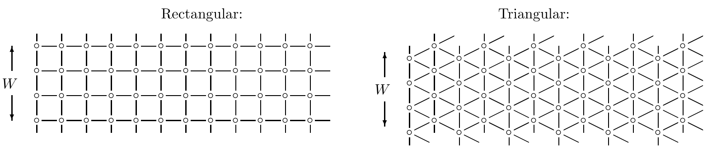
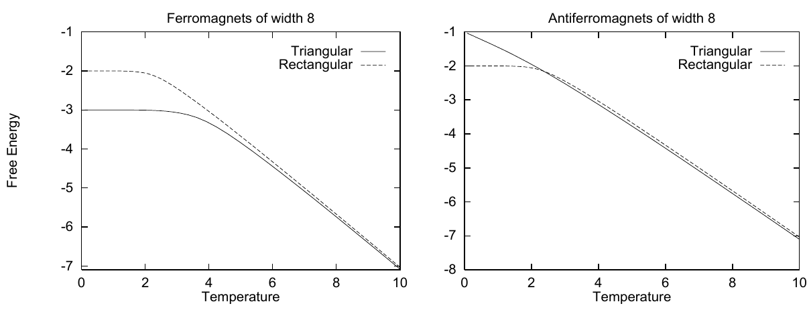
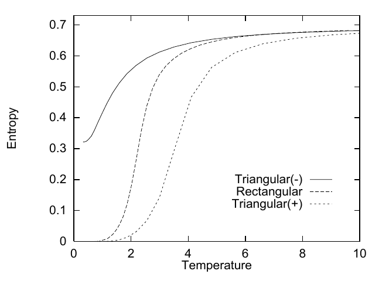

<!-- 原书 PDF 物理页 422；印刷页 410。含图 31.14–31.16、两处斜体小标题。本页末段跨至 PDF423，已按原段合并在本页。 -->

**图 31.14。** 两种狭长条带 Ising 模型。两个自旋之间若有连线，就表示它们是邻居。条带宽度为 $W$，长度为无限大。图内文字：Rectangular 为“矩形晶格”，Triangular 为“三角形晶格”；两侧的 $W$ 标示条带宽度。

### *计算思路：*

我们只需要最大的特征值。有几种方法可求得它，例如从一个初始向量出发，反复用矩阵乘这个向量。由于矩阵的所有元素都为正，主特征向量的所有元素也为正（Frobenius–Perron 定理），所以 $(1,1,\ldots,1)$ 是合理的初始向量。这种迭代法可能比显式计算全部特征值更快。不过，我还是计算了全部特征值；这样不仅能求无限长条带的自由能，也能借助式 (31.32) 求有限长度条带的自由能。

**图 31.15。** 狭长条带 Ising 模型每个自旋的自由能。注意，三角形晶格反铁磁模型在 $T=0$ 时的梯度不为零。图内文字：左图 Ferromagnets of width 8 为“宽度为 8 的铁磁模型”，右图 Antiferromagnets of width 8 为“宽度为 8 的反铁磁模型”；Triangular 为“三角形晶格”，Rectangular 为“矩形晶格”；Free Energy 为“自由能”，Temperature 为“温度”。

### *图形说明：*

在高温下，所有 Ising 模型都应呈现相同的行为：自由能由熵主导，每个自旋的熵为 $\ln 2$，每个自旋的平均能量趋于零。每个自旋的自由能应趋于 $-\ln 2/\beta$。自由能如图 31.15 所示。

从自由能可以得知一个有趣的性质：基态的简并程度。当温度趋于零，Boltzmann 分布集中在基态上。如果基态是简并的（即有多个能量相同的基态），那么 $T\to0$ 时的熵就不为零。我们可由自由能按 $S=-\partial F/\partial T$ 求熵。

**图 31.16。** 宽度为 8 的 Ising 系统的熵（单位：纳特）随温度的变化；由图 31.15 的自由能曲线求导得到。矩形晶格铁磁模型与反铁磁模型具有相同的热学性质。在三角形晶格系统中，上方的曲线（$-$）表示反铁磁模型，下方的曲线（$+$）表示铁磁模型。图内文字：Entropy 为“熵”，Temperature 为“温度”，Triangular(-) 为“三角形晶格（反铁磁）”，Rectangular 为“矩形晶格”，Triangular(+) 为“三角形晶格（铁磁）”。
