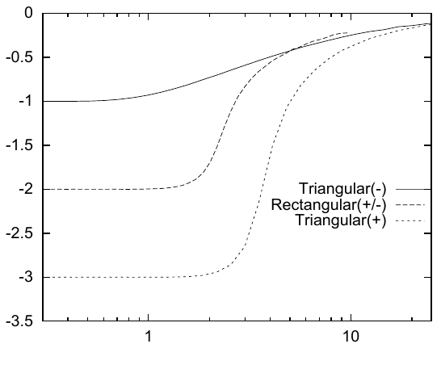
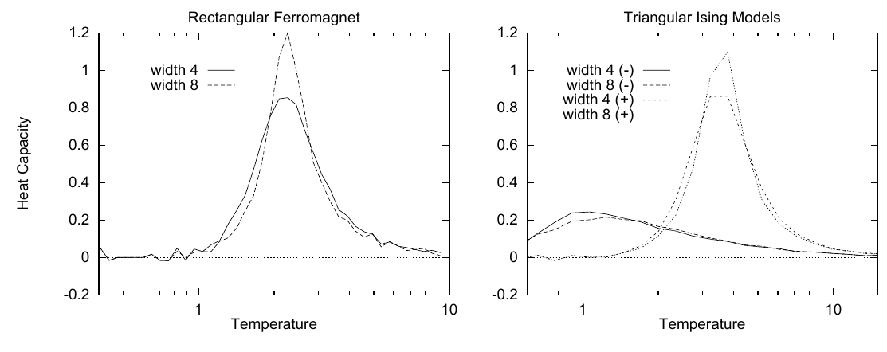
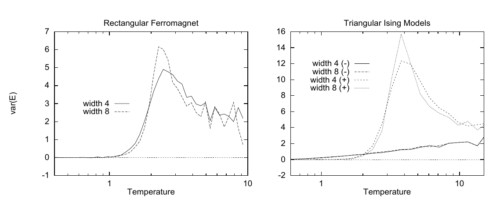

<!-- 原书 PDF 物理页 423；印刷页 411。页首是 PDF422 末段的续句，已合入 PDF422。本页含图 31.17–31.19。 -->

**图 31.17。** 宽度为 8 的狭长条带 Ising 模型的平均能量随温度变化。可与图 31.3 比较。图内文字：Triangular(-) 为“三角形晶格反铁磁模型”，Rectangular(+/-) 为“矩形晶格铁磁或反铁磁模型”，Triangular(+) 为“三角形晶格铁磁模型”。

**图 31.18。** (a) 矩形晶格模型与 (b) 不同宽度的三角形晶格模型的热容；$(+)$ 和 $(-)$ 分别表示铁磁和反铁磁模型。可与图 31.11 比较。图内文字：Rectangular Ferromagnet 为“矩形晶格铁磁模型”，Triangular Ising Models 为“三角形晶格 Ising 模型”；width 4、width 8 为“宽度 4、宽度 8”，附加的 $(+)$、$(-)$ 分别表示铁磁、反铁磁；Heat Capacity 为“热容”，Temperature 为“温度”。

三角形晶格反铁磁模型在绝对零度时的熵似乎约为 $0.3$，也就是其高温熵的大约一半（图 31.16）。平均能量随温度的变化绘于图 31.17；它是用恒等式 $\langle E\rangle=-\partial\ln Z/\partial\beta$ 算出的。

图 31.18 给出宽度为 4 和 8 的三角形晶格模型的热容估计值，它通过直接对平均能量求导得到。图 31.19 则给出能量涨落随温度的变化。这些图本应呈现平滑曲线；曲线上的起伏来自数值计算不够精确。是否存在相变、相变有何性质，并不能从图中直接看清；不过，图形看来与“铁磁模型有相变，而反铁磁模型没有相变”的判断相容。

图 31.15 中的自由能曲线，让我们得以了解如何预测相变温度。可以看到，铁磁系统的两种相各自有简单的自由能：高温相是一条经过 $F=0,T=0$ 的斜直线，低温相则是一条水平线。［每条线的斜率表明相应相中每个自旋的熵。］相变大致发生在两条线的交点。因此，我们预测相变温度与基态能量呈线性关系。

**图 31.19。** (a) 矩形晶格模型与 (b) 不同宽度的三角形晶格模型每个自旋的能量方差；$(+)$ 和 $(-)$ 分别表示铁磁和反铁磁模型。可与图 31.11 比较。图内文字：Rectangular Ferromagnet 为“矩形晶格铁磁模型”，Triangular Ising Models 为“三角形晶格 Ising 模型”；width 4、width 8 为“宽度 4、宽度 8”，附加的 $(+)$、$(-)$ 分别表示铁磁、反铁磁；var(E) 为“能量方差”，Temperature 为“温度”。
