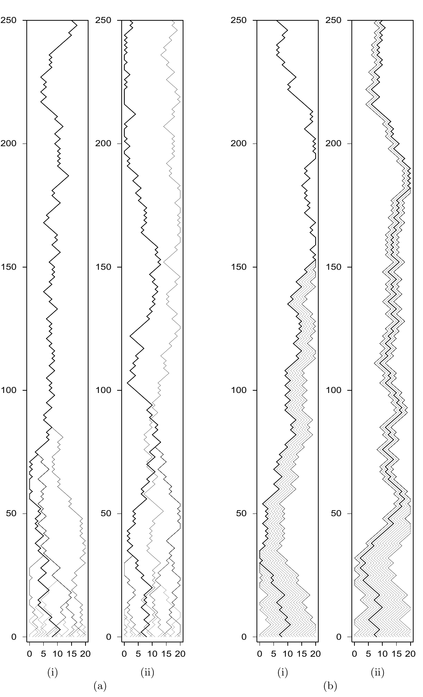

<!-- 原书 PDF 物理页 426；印刷页 414。本页只有图 32.1 及图注。图中坐标、四个面板、子图标记均保留。 -->

**图 32.1。** 汇合是精确采样方法背后的第一个想法。时间由下向上推移。在最左侧面板中，链在 100 步内汇合。每个状态如何使用分配给它的随机数，会影响汇合的性质。(a) Metropolis 模拟器的两次运行：决定提议移动的随机比特取决于当前状态；两次运行使用了不同的随机数种子。(b) 在这个模拟器中，所有状态得到相同的随机提议（“左”或“右”）。每个面板都突出显示了从 $x=8$ 出发的一条轨迹。
