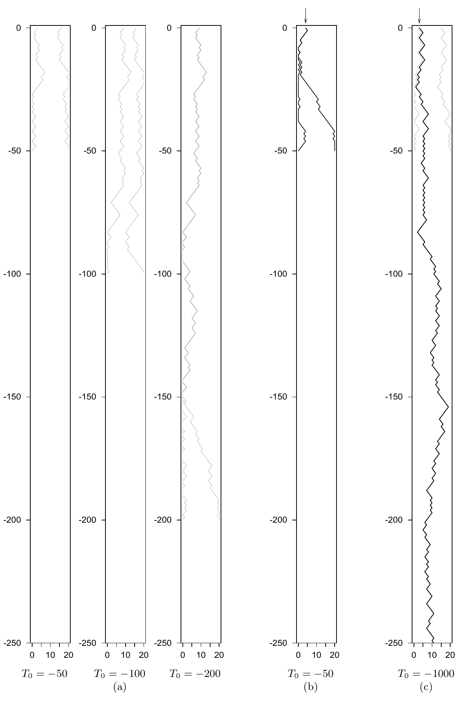

<!-- 原书 PDF 物理页 429；印刷页 417。本页只有图 32.3 及图注。五个面板、箭头、坐标和 T_0 标记完整保留。 -->

**图 32.3。** (a) 状态的有序性是精确采样方法背后的第三个想法。这里显示的是图 32.2(b) 中最左端与最右端的轨迹。为了确定时间零点的状态，我们只需分别从 $T_0=-50$、$T_0=-100$ 和 $T_0=-200$ 开始模拟；最后一次模拟之后便发生汇合。(b)、(c) 使用不同的随机数种子，以这一方法从目标密度生成的另外两个精确样本。所需的起始时刻分别为 $T_0=-50$ 和 $T_0=-1000$。
