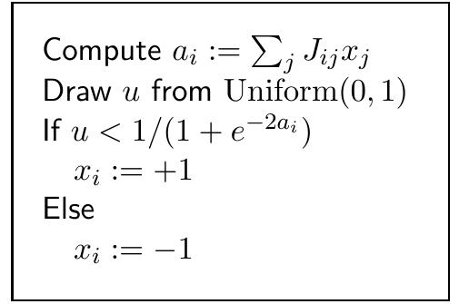
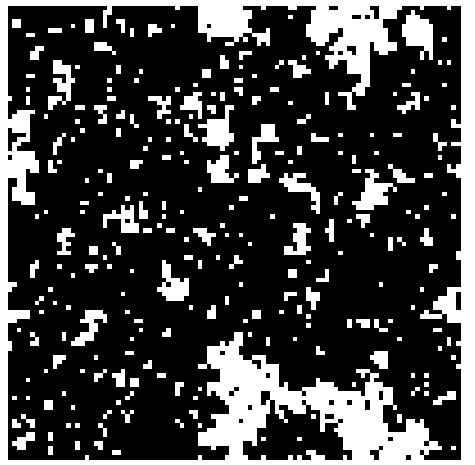

<!-- 原书 PDF 物理页 430；印刷页 418。页首是 PDF427 末段的续文，已在 PDF427 合并；本页含 32.3 节、算法 32.4、图 32.5。末段跨 PDF431，已在本页合并。 -->

## 32.3　从有意义的分布中精确采样

在前述玩具问题中，状态可以排成一维顺序，使任何两条轨迹都不会彼此穿越。许多有意义的状态空间中的状态，也能按偏序（partial order）排列，而且可以找到尊重这一偏序的耦合马尔可夫链。［两个自旋共有四种可能状态，它们的一种偏序关系是：$(+,+)>(+,-)>(-,-)$；以及 $(+,+)>(-,+)>(-,-)$；但 $(+,-)$ 与 $(-,+)$ 之间没有顺序关系。］对于这样的系统，只要检验初始状态为状态空间中“极大”和“极小”状态的所有历史轨迹是否汇合，就能确定全部轨迹已经汇合。

例如，考虑将 Gibbs 采样用于铁磁 Ising 自旋系统，并这样定义状态的偏序：如果对每个自旋 $i$ 都有 $x_i\geq y_i$，那么状态 $\mathbf x$ 就“大于或等于”状态 $\mathbf y$。极大状态是全部自旋朝上，极小状态是全部自旋朝下。马尔可夫链按算法 32.4 所示方式耦合。Propp 和 Wilson（1996）证明，可以为这个系统生成精确样本。不过，如果 Ising 模型的温度低于临界温度，找到精确样本就要花很长时间，因为在这种条件下，Gibbs 采样方法本身混合得很慢。Propp 和 Wilson 又改进了用于 Ising 模型的这一方法：他们使用一种称为“单键热浴算法”（single-bond heat bath algorithm）的马尔可夫链，从相关的“随机簇模型”（random cluster model）中采样；他们证明，能够迅速取得随机簇模型的精确样本，并将其转换为 Ising 模型的精确样本。他们这篇开创性论文中，就有一个处于临界温度、含 1600 万个自旋的 Ising 模型的精确样本。图 32.5 展示了一个较小 Ising 模型的样本。

**算法 32.4。** Gibbs 采样的耦合方法：在每个时间步，所有链更新同一个自旋 $i$，并共用同一随机数序列 $u$，从而彼此耦合。框内步骤：计算 $a_i:=\sum_j J_{ij}x_j$；从 $\operatorname{Uniform}(0,1)$ 中抽取 $u$；如果 $u<1/(1+e^{-2a_i})$，令 $x_i:=+1$；否则令 $x_i:=-1$。

**图 32.5。** D. B. Wilson 生成的一个处于临界温度的 Ising 模型精确样本。用精确采样方法，在普通计算机上只需数秒即可生成这样的样本。

### *用于“非吸引性”分布的精确采样方法推广*

前面简述的 Propp 和 Wilson 的 Ising 模型方法，只能用于他们所说具有“吸引性”（attractive）的概率分布。这里不正式定义这个术语，而从实际用途说明其含义：这种方法适用于全部耦合为正的自旋系统（例如铁磁系统），也适用于少数具有负耦合的特殊自旋系统（例如，我们在第 31 章已经看到，矩形晶格的铁磁与反铁磁系统是等价的）；但它不能用于有些耦合为负的一般自旋系统，因为在这些系统中，从全部自旋朝上和全部自旋朝下的状态出发得到的轨迹，并不保证分别是所有轨迹的上界和下界。不过，幸好不必这么严格。我们可以重新表述 Propp 和 Wilson 的算法，使其推广到有负耦合的自旋系统。精确采样的“摘要状态”（summary state）版本仍然以同一想法为基础：跟踪所有轨迹构成的集合的上下界，并在上下界相等时检测到汇合，进而找到精确样本。但这些上下界本身并非真实轨迹，也不一定是紧的界。
