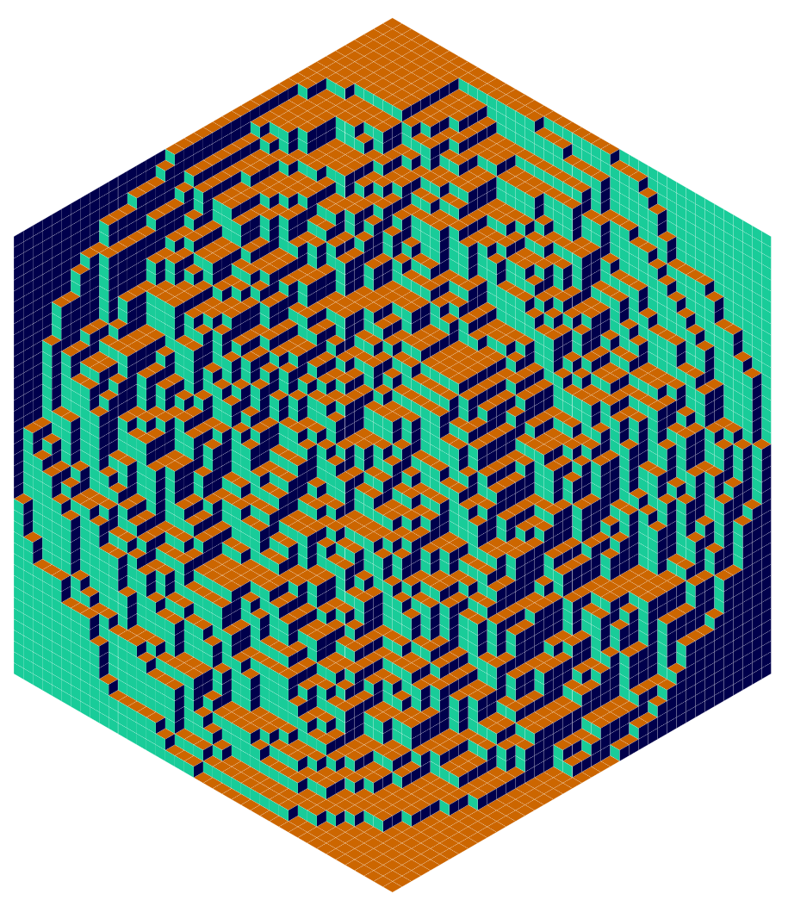

<!-- 原书 PDF 物理页 432；印刷页 420。页首正文是 PDF431 式 (32.1) 后段落的续文，已在 PDF431 合并；本页含图 32.6、32.4 节及习题 32.1–32.4。习题 32.4 跨 PDF433，已在本页合并。 -->

**图 32.6。** J. G. Propp 和 D. B. Wilson 提供的一个样本：用菱形拼块（lozenges）对六边形进行完全随机的铺砌。

## 32.4　习题

▷ 习题 32.1。（难度 2；解答见第 421 页）所有轨迹汇合所需时间的概率分布，与马尔可夫链达到平衡所需的时间之间，是否存在某种关系？请证明它们有关系；或者找出一条可以用两种不同方式实现、且两种实现的汇合时间不同的链。

▷ 习题 32.2。（难度 2）设 Fred 忽略了以下要求：每次从更久远的 $T_0$ 开始重新运行时，同一时刻 $t$ 使用的随机比特必须相同。他制作了一个耦合马尔可夫链模拟器，每次改变 $T_0$，就使用一批新的随机数。如果 Fred 将这种方法用于一条马尔可夫链，会发生什么？这条链以图 32.1(b) 所示的随机比特源驱动 Metropolis 方法，原本打算从状态 $0$、$1$、$2$ 上的均匀分布中采样。

习题 32.3。（难度 5）研究 Holmes 和 Mallick（1998）或 Holmes 和 Denison（2002）如何将完美采样用于线性回归，并尝试推广这种方法。

习题 32.4。（难度 3）汇合这一概念有许多应用。有些姓氏比另一些更常见，还有一些姓氏则会彻底消失。请为这个过程建立模型：需要多久，所有人才会具有同一个姓氏？

类似地，人类基因组中任意特定片段的变异性（法医 DNA 指纹鉴定的基础），其遗传方式也像姓氏。DNA 指纹就像一串姓氏。由于这些“姓氏”会发生汇合，以致有些“姓氏”仅凭偶然就比其他“姓氏”更常见，这一事实是否应影响法院使用 DNA 指纹证据的方式？
