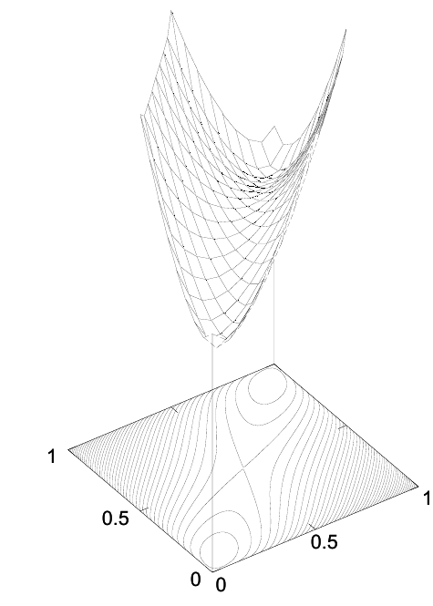

<!-- 原书 PDF 物理页 437；印刷页 425。含式 (33.21)–(33.27)、图 33.1、两条原因列表。第二条原因印在 PDF438，已在本页并入同一列表，后页不重复。 -->

于是得到

$$\langle E(\mathbf x;\mathbf J)\rangle_Q=\sum_{\mathbf x}Q(\mathbf x;\mathbf a)\left[-\frac12\sum_{m,n}J_{mn}x_mx_n-\sum_nh_nx_n\right]\tag{33.21}$$

$$=-\frac12\sum_{m,n}J_{mn}\bar x_m\bar x_n-\sum_nh_n\bar x_n.\tag{33.22}$$

因此，变分自由能为

$$\beta\tilde F(\mathbf a)=\beta\langle E(\mathbf x;\mathbf J)\rangle_Q-S_Q=\beta\left(-\frac12\sum_{m,n}J_{mn}\bar x_m\bar x_n-\sum_nh_n\bar x_n\right)-\sum_n H_2^{(e)}(q_n).\tag{33.23}$$

**图 33.1。** 一个两自旋系统的变分自由能随两个变分参数 $q_1$、$q_2$ 的变化；系统的能量为 $E(\mathbf x)=-x_1x_2$，逆温度 $\beta=1.44$。所绘函数是 $\beta\tilde F=-\beta\bar x_1\bar x_2-H_2^{(e)}(q_1)-H_2^{(e)}(q_2)$，其中 $\bar x_n=2q_n-1$。注意，固定 $q_2$ 时，函数对 $q_1$ 是凸的；固定 $q_1$ 时，函数对 $q_2$ 也是凸的。

现在考虑对变分参数 $\mathbf a$ 最小化这个函数。若 $q=1/(1+e^{-2a})$，熵的导数为

$$\frac{\partial}{\partial q}H_2^{(e)}(q)=\ln\frac{1-q}{q}=-2a.\tag{33.24}$$

因此有

$$\begin{aligned}\frac{\partial}{\partial a_m}\beta\tilde F(\mathbf a)&=\beta\left[-\sum_nJ_{mn}\bar x_n-h_m\right]\left(2\frac{\partial q_m}{\partial a_m}\right)-\ln\left(\frac{1-q_m}{q_m}\right)\left(\frac{\partial q_m}{\partial a_m}\right)\\&=2\left(\frac{\partial q_m}{\partial a_m}\right)\left[-\beta\left(\sum_nJ_{mn}\bar x_n+h_m\right)+a_m\right].\end{aligned}\tag{33.25}$$

当

$$a_m=\beta\left(\sum_nJ_{mn}\bar x_n+h_m\right)\tag{33.26}$$

时，这个导数为零。因此，满足式 (33.26) 以及

$$\bar x_n=\tanh(a_n)\tag{33.27}$$

的任一点，都是 $\tilde F(\mathbf a)$ 的驻点。

变分自由能 $\tilde F(\mathbf a)$ 可能有多个模态；在这种情况下，每个驻点（极大值、极小值或鞍点）都满足式 (33.26) 和 (33.27)。对于耦合矩阵 $\mathbf J$ 任意的系统，使用这两式的一种方法是：每次只用式 (33.26) 更新一个参数 $a_m$ 及相应的 $\bar x_m$。这种*异步参数更新*保证使 $\beta\tilde F(\mathbf a)$ 下降。

式 (33.26) 和 (33.27) 也就是自旋系统的*平均场方程*。变分参数 $a_n$ 可以看作施加在孤立自旋 $n$ 上的虚构场的强度。式 (33.27) 描述自旋 $n$ 的平均响应；式 (33.26) 则描述场 $a_m$ 如何根据所有其他自旋的平均状态而设定。

从变分自由能出发推导，对理解平均场理论有两点帮助。

1. 这种方法为平均场方程配上了目标函数 $\beta\tilde F$；这样的目标函数有助于找出能使同一个函数最小化的其他动力系统。
2. 这一理论很容易推广到其他近似分布。例如，我们可以引入一个更复杂的近似 $Q(\mathbf x;\boldsymbol\theta)$，让它捕捉自旋之间的相关性，而不把自旋建模为彼此独立。之后便可计算变分自由能，并优化更复杂近似中的参数 $\boldsymbol\theta$。近似分布具有的自由度越多，自由能的界就越紧。不过，近似越复杂，计算平均能量或熵通常也越难。
