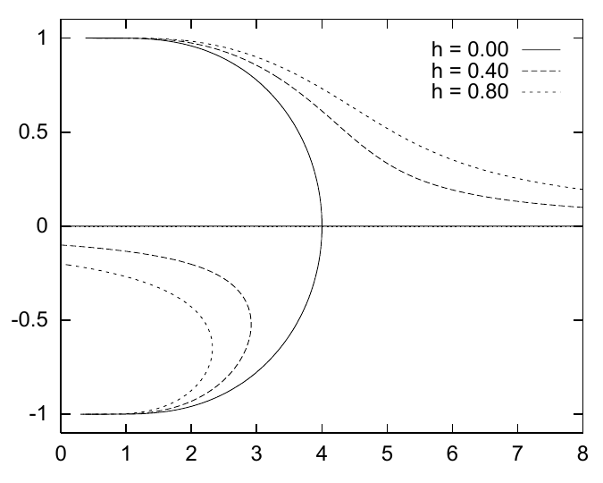

<!-- 原书 PDF 物理页 438；印刷页 426。页首图 33.2，编号列表的第 2 项已与第 1 项合入 PDF437。本页含 33.3 节和式 (33.28)–(33.31)；末段跨 PDF439，已在本页合并。 -->

**图 33.2。** 对 Ising 模型，在三种不同外加场 $h$ 下，求解变分自由能驻值问题得到的结果。横轴是温度 $T=1/\beta$，纵轴是磁化强度 $\bar x$。平均场理论给出的临界温度为 $T_c^{\rm mft}=4$。图内三条曲线标为 $h=0.00$、$h=0.40$ 和 $h=0.80$。

## 33.3　示例：铁磁 Ising 模型的平均场理论

在第 31 章研究的简单 Ising 模型中，若 $m$ 与 $n$ 相邻，每个耦合 $J_{mn}$ 都等于 $J$；否则为零。所有自旋受到相同的外加场 $h_n=h$。一个非常简单的近似分布只用一个变分参数 $a$，它定义的可分离分布为

$$Q(\mathbf x;a)=\frac{1}{Z_Q}\exp\left(\sum_n ax_n\right),\tag{33.28}$$

其中各自旋相互独立，且都以相同的概率

$$q_n=\frac{1}{1+\exp(-2a)}\tag{33.29}$$

取朝上状态。平均磁化强度为

$$\bar x=\tanh(a),\tag{33.30}$$

而确定变分自由能极小值的式 (33.26) 化为

$$a=\beta(CJ\bar x+h),\tag{33.31}$$

其中 $C$ 是一个自旋参与的耦合数；对二维矩形晶格 Ising 模型，$C=4$。我们可以数值求解式 (33.30)、(33.31)，得到 $\bar x$；事实上，最容易的做法是改变 $\bar x$ 并求解 $\beta$，从而得到图 33.2 那样的自由能极小值和极大值随温度变化的曲线。实线显示 $C=4$、$J=1$ 时 $\bar x$ 与 $T=1/\beta$ 的关系。

当 $h=0$ 时，系统在临界温度 $T_c^{\rm mft}$ 发生叉形分岔（pitchfork bifurcation）。［叉形分岔是图 33.2 实线所示的那种转变：当温度从右向左变化时，系统从对参数 $a$ 只有一个极小值，变成有两个极小值和一个极大值；三条线中间的一条对应极大值。实线的形状像一把叉子。］高于此温度时，变分自由能只有一个极小值，位于 $a=0$、$\bar x=0$；这个极小值对应的近似分布在所有状态上都是均匀的。低于临界温度时，则有两个极小值，分别对应破缺对称性的近似分布：所有自旋更可能朝上，或所有自旋更可能朝下。$\bar x=0$ 的状态仍是变分自由能的一个驻点，但现在是局部*极大值*。
