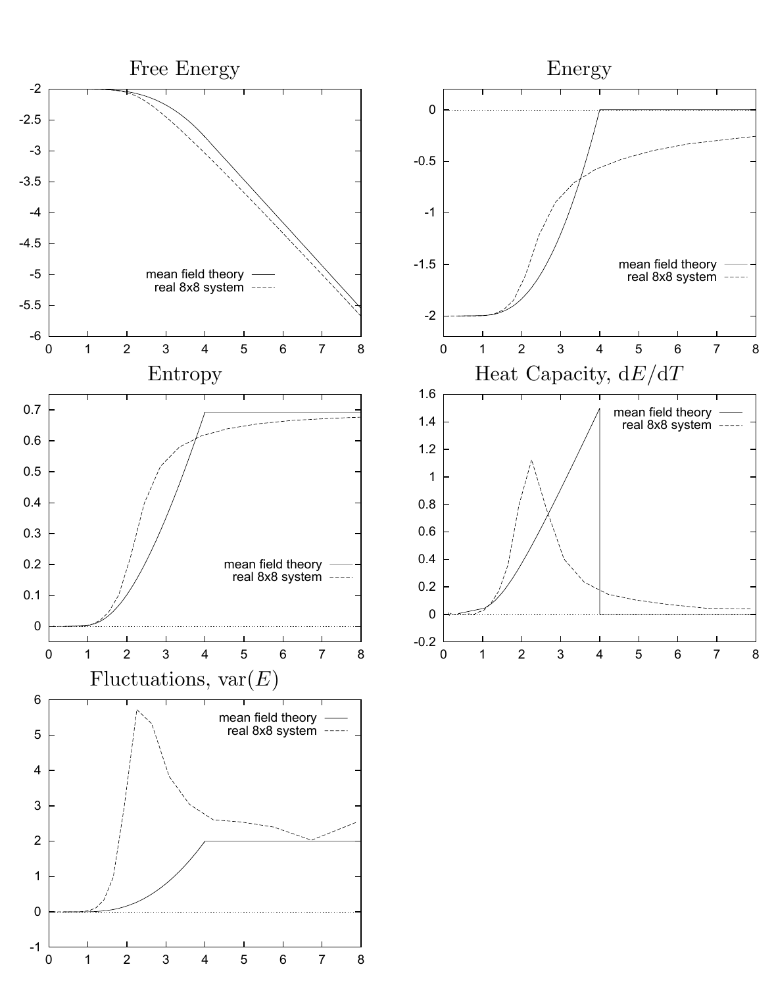

<!-- 原书 PDF 物理页 440；印刷页 428。整页只有图 33.3 及图注；全部五个面板、坐标轴、曲线与英文图内文字保留并提供中文译注。 -->

**图 33.3。** 比较近似分布与一个真实的 $8\times8$ 系统片段的性质。注意，近似分布的变分自由能确实是真实系统自由能的上界。所有量都按“每个自旋”给出。图内五个英文标题依次译为：Free Energy“自由能”、Energy“能量”、Entropy“熵”、Heat Capacity, dE/dT“热容，$dE/dT$”、Fluctuations, var(E)“涨落，$\operatorname{var}(E)$”。各面板图例 mean field theory 为“平均场理论”，real 8x8 system 为“真实的 $8\times8$ 系统”。
