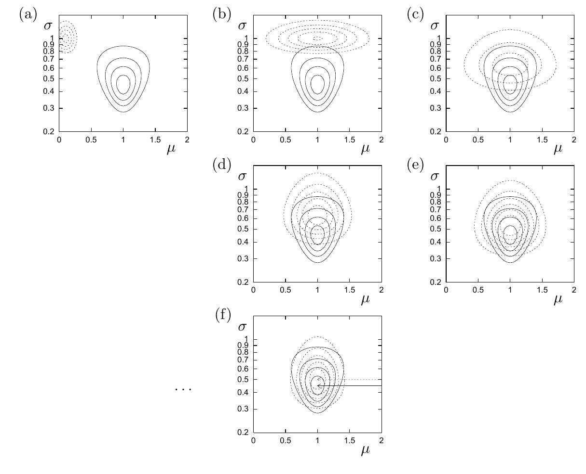

<!-- 原书 PDF 物理页 442；印刷页 430。含图 33.4 六面板、式 (33.38)–(33.43)、两段斜体优化小标题及右边页边提示。 -->

**图 33.4。** 近似分布的优化。实线等高线表示后验分布 $P(\mu,\sigma\mid\{x_n\})$，它与图 24.1 中的分布相同。(a) 初始条件：虚线等高线表示一个任意的可分离近似分布 $Q(\mu,\sigma)$。(b) 按式 (33.41) 更新了 $Q_\mu$。(c) 按式 (33.44) 更新了 $Q_\sigma$。(d) 再次更新 $Q_\mu$。(e) 再次更新 $Q_\sigma$。(f) 迭代 15 次后得到的收敛近似。箭头指向两个分布的峰值位置：$P$ 的峰在 $\sigma_N=0.45$，$Q$ 的峰在 $\sigma_{N-1}=0.5$。图内横轴为 $\mu$，纵轴为 $\sigma$；(a)–(f) 为六个面板的标记。

### *优化 $Q_\mu(\mu)$*

把 $\tilde F$ 看作 $Q_\mu(\mu)$ 的泛函，可得

$$\tilde F=-\int d\mu\,Q_\mu(\mu)\left[\int d\sigma\,Q_\sigma(\sigma)\ln P(D\mid\mu,\sigma)+\ln\frac{P(\mu)}{Q_\mu(\mu)}\right]+\kappa\tag{33.38}$$

$$=\int d\mu\,Q_\mu(\mu)\left[\int d\sigma\,Q_\sigma(\sigma)\frac{N\beta}{2}(\mu-\bar x)^2+\ln Q_\mu(\mu)\right]+\kappa',\tag{33.39}$$

其中 $\beta\equiv1/\sigma^2$，$\kappa$ 与 $\kappa'$ 表示不依赖 $Q_\mu(\mu)$ 的常数。对 $Q_\sigma$ 的依赖于是简化为仅依赖如下平均值：

$$\bar\beta\equiv\int d\sigma\,Q_\sigma(\sigma)\frac{1}{\sigma^2}.\tag{33.40}$$

现在可以看出，$-N\bar\beta(\mu-\bar x)^2/2$ 是一个高斯分布的对数；这个高斯分布与在取特定值 $\beta=\bar\beta$ 时的后验分布相同。由于相对熵 $\int Q\ln(Q/P)$ 在 $Q=P$ 时取最小值，对于固定的 $Q_\sigma$，可以立即写出使 $\tilde F$ 最小的分布：

$$Q_\mu^{\rm opt}(\mu)=P(\mu\mid D,\bar\beta,\mathcal H)=\operatorname{Normal}(\mu;\bar x,\sigma_{\mu\mid D}^2),\tag{33.41}$$

其中 $\sigma_{\mu\mid D}^2=1/(N\bar\beta)$。

### *优化 $Q_\sigma(\sigma)$*

我们用关于 $\beta$ 的密度表示 $Q_\sigma(\sigma)$：$Q_\sigma(\beta)\equiv Q_\sigma(\sigma)|d\sigma/d\beta|$。把 $\tilde F$ 看作 $Q_\sigma(\beta)$ 的泛函，忽略加性常数，有

$$\tilde F=-\int d\beta\,Q_\sigma(\beta)\left[\int d\mu\,Q_\mu(\mu)\ln P(D\mid\mu,\sigma)+\ln\frac{P(\beta)}{Q_\sigma(\beta)}\right]\tag{33.42}$$

$$=\int d\beta\,Q_\sigma(\beta)\left[\frac{(N\sigma_{\mu\mid D}^2+S)\beta}{2}-\left(\frac N2-1\right)\ln\beta+\ln Q_\sigma(\beta)\right],\tag{33.43}$$

先验分布 $P(\sigma)\propto1/\sigma$ 变换后成为 $P(\beta)\propto1/\beta$。
