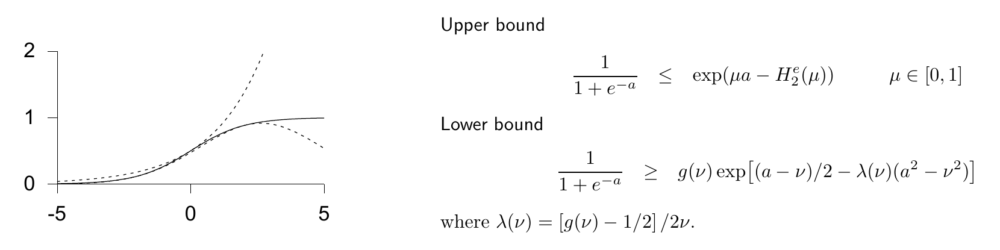

<!-- 原书 PDF 物理页 445；印刷页 433。含图 33.5 与图内公式/英文译注、习题 33.2–33.4、33.8 节及式 (33.52)–(33.53)。末段跨 PDF446，已在本页合并。 -->

**图 33.5。** Jaakkola–Jordan 变分方法示意。图中实线是 logistic 函数 $g(a)\equiv1/(1+e^{-a})$，另两条曲线分别给出它的上界和下界。上下界是 $a$ 的指数函数或高斯函数，因此更容易对它们积分。图中参数为 $\mu=0.505$、$\nu=-2.015$。图内文字与公式的译注：“Upper bound”是“上界”，满足 $1/(1+e^{-a})\leq\exp[\mu a-H_2^{e}(\mu)]$，$\mu\in[0,1]$；“Lower bound”是“下界”，满足 $1/(1+e^{-a})\geq g(\nu)\exp[(a-\nu)/2-\lambda(\nu)(a^2-\nu^2)]$；“where”引出的定义是 $\lambda(\nu)=[g(\nu)-1/2]/(2\nu)$。

遗憾的是，这个分布对变分自由能贡献了一个无穷大的积分 $\int d^D\boldsymbol\theta\,Q_{\boldsymbol\theta}(\boldsymbol\theta)\ln Q_{\boldsymbol\theta}(\boldsymbol\theta)$，所以最好把这一项从 $\tilde F$ 中拿掉，视为一个加性常数。［如果目标是最小化 $\tilde F$，使用 δ 函数形式的 $Q_{\boldsymbol\theta}$ 并不是好主意！］接下来，我们要推导软 K 均值算法。

▷ 习题 33.2。（难度 2）证明：给定 $Q_{\boldsymbol\theta}(\boldsymbol\theta)=\delta(\boldsymbol\theta-\boldsymbol\theta^*)$，使 $\tilde F$ 最小的最优 $Q_k$ 是可分离分布，其中 $k_n=k$ 的概率等于责任度 $r_k^{(n)}$。

▷ 习题 33.3。（难度 3）证明：给定上述可分离的 $Q_k$，使 $\tilde F$ 最小的最优 $\boldsymbol\theta^*$，由软 K 均值算法的更新步得到。［假定 $\boldsymbol\theta$ 的先验分布均匀。］

习题 33.4。（难度 4）如果允许 $Q_{\boldsymbol\theta}$ 是比 δ 函数更一般的分布，就能立即改进软 K 均值聚类得到的无穷大 $\tilde F$。请推导一个更新步骤，允许 $Q_{\boldsymbol\theta}$ 是可分离分布，即 $Q_\mu(\{\boldsymbol\mu\})$、$Q_\sigma(\{\boldsymbol\sigma\})$ 和 $Q_\pi(\boldsymbol\pi)$ 的乘积。讨论推广后的算法是否仍会遇到软 K 均值的“爆炸”（kaboom）问题：算法把一个不断缩小的高斯分布黏在单个数据点上。

可惜，允许 $Q_{\boldsymbol\theta}$ 不再是 δ 函数，看起来是很有希望的推广，而且“爆炸”问题也消失了，但这种近似推断方法仍可能出现其他异常现象，涉及 $\tilde F$ 的局部极小值。进一步阅读可见 MacKay（1997a；2001）。

## 33.8　自由能最小化之外的变分方法

除了最小化近似分布 $Q$ 与复杂分布 $P(\mathbf x)$ 之间的相对熵，还有其他近似 $P(\mathbf x)$ 的策略。Jaakkola 和 Jordan 首创的一种方法，是为 $P$ 构造可调的上界 $Q^U$ 与下界 $Q^L$，如图 33.5 所示。这些界是未归一化的密度，由变分参数决定；调整参数是为了尽可能收紧界。可以调整下界，使

$$\sum_{\mathbf x}Q^L(\mathbf x)\tag{33.52}$$

最大；也可以调整上界，使

$$\sum_{\mathbf x}Q^U(\mathbf x)\tag{33.53}$$

最小。然后，用优化后的界的归一化版本，计算预测分布的近似值。有关这些方法的进一步阅读，可参见 Jaakkola 和 Jordan（2000a、2000b、1996）以及 Gibbs 和 MacKay（2000）。
