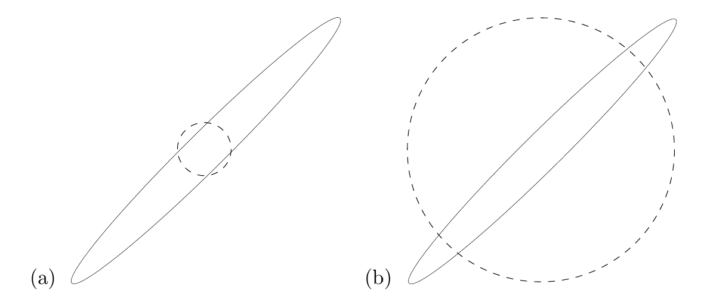

<!-- 原书 PDF 物理页 448；印刷页 436。本章终页，含图 33.6、式 (33.60)–(33.62) 和习题 33.6 的解答。 -->

**图 33.6。** 用两个可分离高斯近似（虚线）去近似一个二维高斯分布（实线）。(a) 使变分自由能最小的近似。(b) 使目标函数 $G$ 最小的近似。两图中的曲线都是满足 $\mathbf x^{\mathsf T}\mathbf A\mathbf x=1$ 的等高线，其中 $\mathbf A$ 是高斯分布协方差矩阵的逆矩阵。

相对地，如果使用目标函数 $G$，则得到

$$G(\sigma_Q^2)=\frac12\left(\ln\sigma_Q^2+\frac{\sigma_1^2}{\sigma_Q^2}+\ln\sigma_Q^2+\frac{\sigma_2^2}{\sigma_Q^2}\right)+\text{常数},\tag{33.60}$$

其中常数只依赖 $\sigma_1$ 和 $\sigma_2$。求导，

$$\frac{d}{d\ln\sigma_Q^2}G=\frac12\left[2-\left(\frac{\sigma_1^2}{\sigma_Q^2}+\frac{\sigma_2^2}{\sigma_Q^2}\right)\right],\tag{33.61}$$

当

$$\sigma_Q^2=\frac12(\sigma_1^2+\sigma_2^2)\tag{33.62}$$

时，导数为零。因此，近似分布的方差应设为目标分布 $P$ 在两个方向上的平均方差。

当 $\sigma_1=10$、$\sigma_2=1$ 时，得到 $\sigma_Q\simeq10/\sqrt2$；它只比 $\sigma_1$ 小 $\sqrt2$ 倍，与 $\sigma_2$ 的取值无关。图 33.6 按比例展示了这两种近似。

**习题 33.6 的解答（第 434 页）。** 当然，最好的变分近似就是目标分布 $P$ 本身。若假定无法做到这一点，好的变分近似会比真实分布*更集中*；相反，好的采样分布应比真实分布*尾部更重*。过于集中的分布会是一个糟糕的采样分布，其方差会很大。
