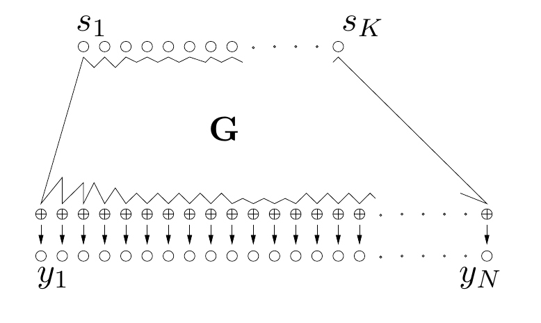

<!-- 原书 PDF 物理页 449；印刷页 437。第 34 章起页，含图 34.1、34.1/34.2 节及式 (34.1)。末句在 PDF450 以 “H, is:” 接续，已在本页合成完整引句。 -->

# 第 34 章　独立成分分析与隐变量建模

> **编者导读（非原书正文）**　本章从隐变量生成模型出发，推导独立成分分析的似然与学习规则，再讨论模型假设、实际应用及更一般的隐变量模型。

## 34.1　隐变量模型

许多统计模型是生成模型（即为所讨论情境中的所有变量指定完整概率密度的模型），它们利用*隐变量*描述可观测量上的概率分布。

隐变量模型的例子包括第 22 章的混合模型：它将可观测量视为来自若干简单概率分布的叠加混合（其中的隐变量是各样本未知的类别标签）；还包括隐马尔可夫模型（Rabiner 和 Juang，1986；Durbin 等，1998）以及因子分析。

纠错码的解码问题也可以用隐变量模型来理解，如图 34.1 所示。在这个例子中，编码矩阵 $\mathbf G$ 通常事先已知。在隐变量建模中，与 $\mathbf G$ 相对应的参数通常未知，必须和隐变量 $\mathbf s$ 一起从数据中推断出来。

**图 34.1。** 把纠错码看作隐变量模型。$K$ 个隐变量是相互独立的源比特 $s_1,\ldots,s_K$；它们通过生成矩阵 $\mathbf G$ 产生可观测量。图内标记：上方 $s_1,\ldots,s_K$ 为源比特，中间 $\mathbf G$ 为生成矩阵，下方 $y_1,\ldots,y_N$ 为可观测量。

隐变量通常服从简单的分布，而且往往是可分离分布。因此，拟合隐变量模型时，我们是在寻找一种用“独立成分”描述数据的方法。“独立成分分析”（independent component analysis）算法或许对应着具有连续隐变量的最简单的隐变量模型。

## 34.2　独立成分分析的生成模型

设 $N$ 个观测样本组成数据集 $D=\{\mathbf x^{(n)}\}_{n=1}^N$，并假定它们按如下方式生成。每个 $J$ 维向量 $\mathbf x$ 都是 $I$ 个底层源信号 $\mathbf s$ 的线性混合：

$$\mathbf x=\mathbf G\mathbf s,\tag{34.1}$$

其中混合系数矩阵 $\mathbf G$ 未知。

如果假定源信号数等于观测分量数，即 $I=J$，就会得到最简单的算法。我们的目标是恢复源变量 $\mathbf s$，允许各分量相差一个乘法因子，顺序也可能被置换。换一种说法，仅根据一组观测样本 $\{\mathbf x\}$，我们要构造 $\mathbf G$ 的逆矩阵，允许结果再右乘一个因子。我们假定隐变量彼此独立，其边缘分布为 $P(s_i\mid\mathcal H)\equiv p_i(s_i)$。这里，$\mathcal H$ 表示所假定的模型形式，以及对隐变量所假定的概率分布 $p_i$。

给定 $\mathbf G$ 和 $\mathcal H$，可观测变量与隐变量的联合概率为：
