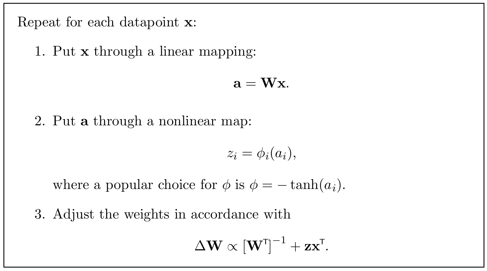

<!-- 原书 PDF 物理页 451；印刷页 439。含原书描边算法 34.2、式 (34.14)–(34.18)、斜体小标题“φ 的选择”。算法框保留原图，框内英文另有逐步中文译注。 -->

**算法 34.2。** 独立成分分析：在线最速上升版本。另见更值得优先采用的算法 34.4。

算法框内文字译注：对每个数据点 $\mathbf x$，重复以下步骤：

1. 对 $\mathbf x$ 作线性映射：$\mathbf a=\mathbf W\mathbf x$。
2. 对 $\mathbf a$ 作非线性映射：$z_i=\phi_i(a_i)$；$\phi$ 的一种常用选择是 $\phi=-\tanh(a_i)$。
3. 按 $\Delta\mathbf W\propto[\mathbf W^{\mathsf T}]^{-1}+\mathbf z\mathbf x^{\mathsf T}$ 调整权重。

再令 $z_i=\phi_i(a_i)$；它指出要提高数据的概率，$a_i$ 应朝哪个方向改变。利用式 (34.10) 和 (34.11)，可以求得对 $G_{ji}$ 的梯度：

$$\frac{\partial}{\partial G_{ji}}\ln P(\mathbf x^{(n)}\mid\mathbf G,\mathcal H)=-W_{ij}-a_i z_{i'}W_{i'j}.\tag{34.14}$$

也可以改为对 $W_{ij}$ 求导：

$$\frac{\partial}{\partial W_{ij}}\ln P(\mathbf x^{(n)}\mid\mathbf G,\mathcal H)=G_{ji}+x_jz_i.\tag{34.15}$$

如果让 $\mathbf W$ 沿这个梯度上升，就得到学习规则

$$\Delta\mathbf W\propto[\mathbf W^{\mathsf T}]^{-1}+\mathbf z\mathbf x^{\mathsf T}.\tag{34.16}$$

到此为止的算法汇总于算法 34.2。

### *$\phi$ 的选择*

函数 $\phi$ 的选择，决定了对隐变量 $\mathbf s$ 所假定的先验分布。

先看线性选择 $\phi_i(a_i)=-\kappa a_i$。由式 (34.13) 可知，这隐含地假定隐变量服从高斯分布。隐变量的高斯分布在旋转隐变量坐标时保持不变，因此没有证据会偏向隐变量空间的某个特定方向。这个线性算法因而不太有用：它永远无法恢复矩阵 $\mathbf G$ 或原始源信号。我们唯一的希望就是源信号并非高斯分布。幸好，大多数真实源信号具有非高斯分布，而且尾部往往比高斯分布更重。

因此，接下来考虑常用的 $\tanh$ 非线性函数。如果取

$$\phi_i(a_i)=-\tanh(a_i),\tag{34.17}$$

就隐含地假定

$$p_i(s_i)\propto1/\cosh(s_i)\propto\frac{1}{e^{s_i}+e^{-s_i}}.\tag{34.18}$$

这种隐变量分布的尾部比高斯分布更重。
