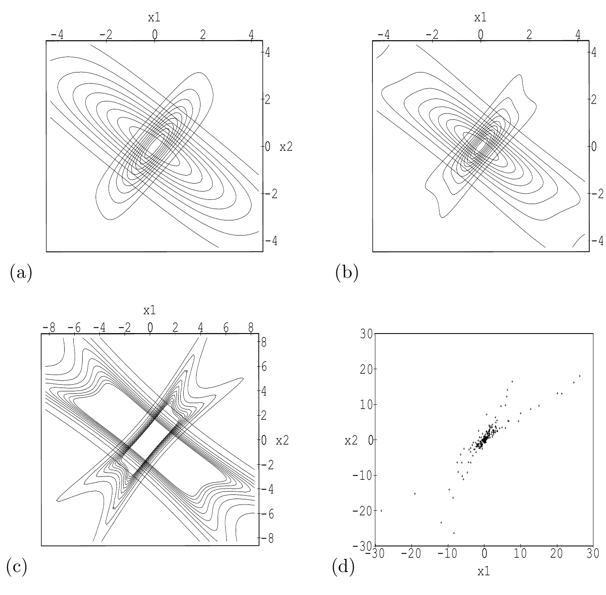

<!-- 原书 PDF 物理页 452；印刷页 440。含图 34.3 四面板、34.3 节起始及两个斜体小标题，无编号公式。末段文献年份在 PDF453 页首续完，已在本页合并。 -->

**图 34.3。** 学习算法所隐含的生成模型示意。(a) 隐变量服从 $1/\cosh$ 分布时，两个可观测量上的分布。取 $\mathbf G=\begin{bmatrix}3/4&1/2\\1/2&1\end{bmatrix}$ 得到较集中的分布；取 $\mathbf G=\begin{bmatrix}2&-1\\-1&3/2\end{bmatrix}$ 得到较宽的分布。(b) 隐变量服从柯西分布时，生成分布的等高线。学习算法通过最大化似然，使这种变形虫状的分布贴合经验数据。(b) 中的等高线图不足以表现这种重尾分布。(c) 柯西分布尾部的部分区域；这些等高线所对应的密度，是原点处密度的 $0.01\ldots0.1$ 倍。(d) 从 (b)、(c) 所示的一个生成分布抽取的数据。你能判断是哪一个吗？共生成 200 个样本，其中 196 个落在图示区域内。图内横纵轴分别标为 $x_1$、$x_2$，四面板依次标为 (a)–(d)。

也可以使用带增益参数 $\beta$ 的 $\tanh$ 非线性函数，即 $\phi_i(a_i)=-\tanh(\beta a_i)$。它隐含的概率模型是 $p_i(s_i)\propto 1/[\cosh(\beta s_i)]^{1/\beta}$。当 $\beta$ 很大时，这个非线性函数趋于阶跃函数，概率分布 $p_i(s_i)$ 趋于双指数分布 $p_i(s_i)\propto\exp(-|s_i|)$。当 $\beta\to0$ 时，$p_i(s_i)$ 趋于均值为零、方差为 $1/\beta$ 的高斯分布。还可以采用比这些分布尾部更重的分布，例如 Student 分布和柯西分布。

### *分布示例*

图 34.3(a–c) 展示了当各独立成分服从 $1/\cosh$ 分布或柯西分布时，独立成分模型所生成的典型分布。图 34.3d 展示了从柯西模型生成的一些样本。由于柯西分布的尾部更重，它最清楚地展示了预测分布如何依赖于所假定的生成参数 $\mathbf G$。

## 34.3　一种协变、较简单且更快的学习算法

由此，我们推导出一种对似然函数作最速下降的学习算法。即便处理玩具数据，这种算法也不太快；它的数值条件很差，恰好说明了一条普遍建议：*求目标函数的梯度是个好主意，但直接沿梯度上升未必是。*算法条件差，可以从其中的矩阵求逆看出：逆矩阵的值可能任意大，甚至不存在。

### *一般意义上的协变优化*

协变性原则指出，一个自洽的算法无论所用量采用什么计量单位，都应给出同样的结果（Knuth，1968）。
