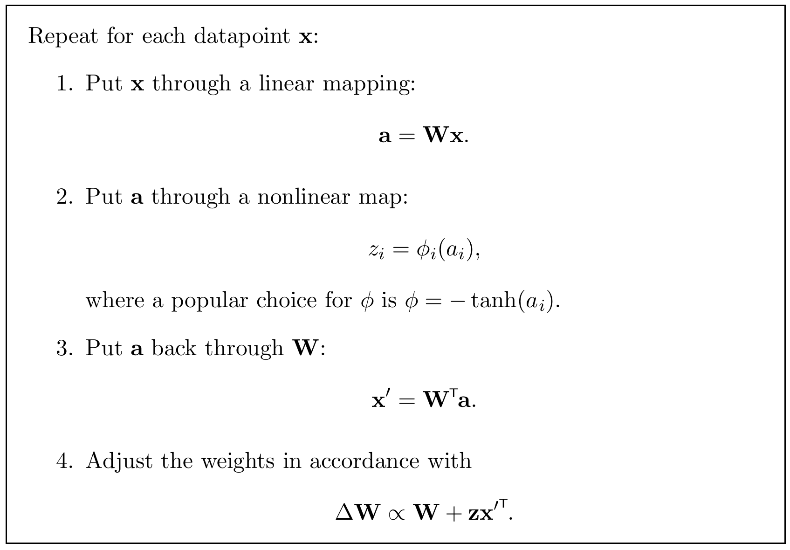

<!-- 原书 PDF 物理页 455；印刷页 443。含原书描边算法 34.4、式 (34.29)、“延伸阅读”及斜体小标题“无限模型”。末段跨 PDF456，已在本页合并。 -->

**算法 34.4。** 独立成分分析：协变版本。

算法框内文字译注：对每个数据点 $\mathbf x$，重复以下步骤：

1. 对 $\mathbf x$ 作线性映射：$\mathbf a=\mathbf W\mathbf x$。
2. 对 $\mathbf a$ 作非线性映射：$z_i=\phi_i(a_i)$；$\phi$ 的一种常用选择是 $\phi=-\tanh(a_i)$。
3. 使 $\mathbf a$ 经 $\mathbf W$ 反向传递：$\mathbf x'=\mathbf W^{\mathsf T}\mathbf a$。
4. 按 $\Delta\mathbf W\propto\mathbf W+\mathbf z{\mathbf x'}^{\mathsf T}$ 调整权重。

用这一量表示，协变算法可写为

$$\Delta W_{ij}=\eta\left(W_{ij}+x_j'z_i\right).\tag{34.29}$$

右侧的 $\left(W_{ij}+x_j'z_i\right)$ 有时称为*自然梯度*（natural gradient）。协变独立成分分析算法汇总于算法 34.4。

### 延伸阅读

ICA 最初由信息最大化方法推导出来（Bell 和 Sejnowski，1995）。Hinton 等（2001）从能量函数出发给出 ICA 的另一种观点，并由此引出更一般的模型。Pearlmutter 和 Parra（1996、1997）给出了 ICA 的另一种推广。如今，ICA 应用的文献已非常丰富。Miskin（2001）、Miskin 和 MacKay（2000、2001）提出了一种用于 ICA 类模型的变分自由能最小化方法。关于盲分离及非 ICA 算法，可进一步参阅 Jutten 和 Herault（1991）、Comon 等（1991）、Hendin 等（1994）、Amari 等（1996）以及 Hojen-Sorensen 等（2002）。

### *无限模型*

虽然具有有限个隐变量的模型已被广泛使用，但在很多情况下，用非常多个隐变量才能最准确地表达我们对问题的认识。

以聚类为例。如果用聚类模型来描述词语，以解决语音识别问题，那么应使用多少个簇？可能出现的词语数目没有上界（第 18.2 节），所以我们真正希望使用一种可以不断产生新簇的模型。

而且，如果仔细建立某一个英语单词对应簇的模型，很可能发现这个单词的簇本身也该由若干簇组成，形成“簇中有簇”的层级结构。层级结构的前几层可能将男性说话者与女性说话者分开，再区分来自印度、英国、欧洲等不同地区的说话者。每个这样的簇内，还会有区分各地区不同口音的子簇；子簇又可以继续细分，直到村庄、街道或家庭的层级。
