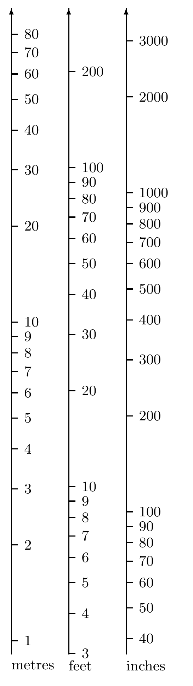

<!-- 原书 PDF 物理页 457；印刷页 445。第 35 章起页，含 35.1 节、例 35.1、图 35.1、三条无编号常量式和式 (35.1)。 -->

# 第 35 章　若干推断专题

> **编者导读（非原书正文）**　本章通过若干独立的例题与习题，讨论对量值一无所知时怎样分配概率，以及重尾数据、因果方向等情形中的推断问题。

## 35.1　一无所知时，你知道什么？

**例 35.1。** 在一项精确的实验中测量一个实变量 $x$。例如，$x$ 可以是中子的半衰期、萤火虫发出光的波长、沃斯托克湖的深度，或者木星的卫星木卫一的质量。

$x$ 的数值以“1”开头的概率是多少？电子的电荷（按国际单位制计）就是一个例子：

$$e=1.602\ldots\times10^{-19}\,\mathrm C,$$

玻尔兹曼常量也是：

$$k=1.380\,66\ldots\times10^{-23}\,\mathrm J\,\mathrm K^{-1}?$$

而它以“9”开头的概率又是多少？例如法拉第常量为

$$\mathcal F=9.648\ldots\times10^4\,\mathrm C\,\mathrm{mol}^{-1}?$$

第二位数字又如何？$x$ 的尾数以“1.1…”开头的概率是多少？$x$ 以“9.9…”开头的概率又是多少？

**解答。** 研究中子、萤火虫、南极或木星的专家，或许能预测 $x$ 的数值，从而有一定把握预测它的首位数字。但对这个问题毫无知识的人又该怎么办？“一无所知”对应着什么概率分布？

解决这个问题的一种方法，是注意到 $x$ 的计量单位并未指定。如果用两周而非秒来测量中子半衰期，数值 $x$ 要除以 $1\,209\,600$；如果用年来测量，就要除以 $3\times10^7$。现在，单位改变会影响我们对 $x$ 的认识，特别是对其首位数字的认识吗？对专家来说，会；但我们考虑的是一个真正一无所知的人，对他来说不会。他对 $x$ 首位数字的预测与计量单位无关。单位的任意性意味着，当 $x$ 乘以任意数时，概率分布应保持*不变*。

**图 35.1。** 从对数刻度来看，采用不同单位的标尺相对于彼此发生平移。图内三列自左至右分别是“米”（metres）、“英尺”（feet）和“英寸”（inches）；各列数字与刻度位置完整保留。

如果不知道一个量的计量单位，那么其首位数字的概率必须与对数刻度上对应区段的长度成正比。因此，数值的首位数字为 1 的概率是

$$p_1=\frac{\log2-\log1}{\log10-\log1}=\frac{\log2}{\log10}.\tag{35.1}$$
