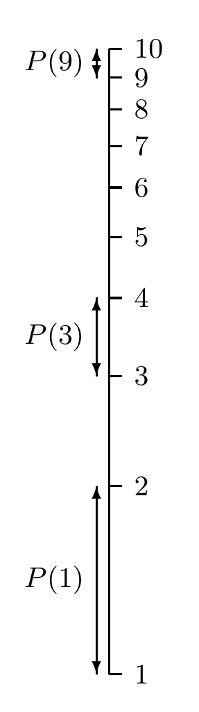

<!-- 原书 PDF 物理页 458；印刷页 446。含式 (35.2)–(35.3)、无编号首位数字页边示意图、习题 35.2–35.4 及 35.2 节。习题 35.4 跨 PDF459，数据与末问已合在本页。 -->

因为 $2^{10}=1024\simeq10^3=1000$，所以无需计算器就知道 $10\log2\simeq3\log10$，从而

$$p_1\simeq\frac3{10}.\tag{35.2}$$

更一般地，首位数字为 $d$ 的概率是

$$\frac{\log(d+1)-\log d}{\log10-\log1}=\log_{10}\left(1+\frac1d\right).\tag{35.3}$$

关于首位数字的这个规律称为本福特定律（Benford’s law）。一无所知并不对应着 $d$ 上的均匀概率分布。□

页边图内标记译注：刻度从 1 到 10，$P(1)$、$P(3)$、$P(9)$ 旁的箭头分别标出首位数字为 1、3、9 时在对数刻度上占据的区间。

▷ 习题 35.2。（难度 2）一根大头针在空中翻滚。它在空中某一时刻与竖直方向之间的夹角 $\theta_1$ 服从什么概率分布？给这根翻滚的大头针拍照后，照片中它与竖直方向之间的夹角 $\theta_3$ 又服从什么概率分布？

▷ 习题 35.3。（难度 2）*打破纪录。*设我们持续记录某个量 $x$ 的世界纪录，例如地震震级，或世界锦标赛中的跳远成绩。假定挑战纪录的尝试以稳定速率发生；还假定结果 $x$ 的底层概率分布 $P(x)$ 不变——我认为对体育活动来说，这个假定不大可能成立，但仍值得考虑。再假定我们对 $P(x)$ 一无所知，那么，对于纪录被打破的各日期之间连续出现的时间间隔，我们能作出什么预测？

## 35.2　Luria–Delbrück 分布

习题 35.4。（难度 $3^C$；解答见第 449 页）Luria 和 Delbrück（1943）在其里程碑式论文中证明，细菌可以从对病毒敏感突变为对病毒有抵抗力。他们希望根据实验结束时发现的突变体总数，估计一个指数增长的细菌群体中的突变率。这个问题很难，因为所测量的量（发生突变的细菌数）服从重尾概率分布：实验早期发生的一次突变，可能产生大量突变体。遗憾的是，Luria 和 Delbrück 当时不懂贝叶斯定理；他们应对重尾分布的办法包含一些随意的权宜处理，最终给出两种不同的突变率估计量。其中一种估计量以突变细菌数在多次实验中的平均值为基础，方差大得惊人，但抽样理论研究者仍继续使用它，并围绕它构造置信区间（Kepler 和 Oprea，2001）。本题中，你要正确地完成推断。

在每份培养物中，一个原本不具抵抗力的细菌经过 $g$ 代，产生 $N=2^g$ 个后代；除突变造成的差异外，它们都是克隆体。然后使最终的培养物暴露于病毒，并测量具有抵抗力的细菌数 $n$。根据如今得到认可的突变假说，这些细菌的抵抗力来自菌落生长期间发生的随机突变。每个细胞每代的突变率 $a$，大约是亿分之一。发生突变的机会总数约为 $N$，因为 $\sum_{i=0}^{g-1}2^i\simeq2^g=N$。如果一个细菌在第 $i$ 代发生突变，它的全部后代都会继承该突变；这个祖先最终贡献的抗性细菌数为 $2^{g-i}$。

设有 $M$ 次相互独立的实验，每次都生成一个规模为 $N$ 的菌落，测得抗性细菌数为 $\{n_m\}_{m=1}^M$。我们能从这些数据推断出多少关于突变率 $a$ 的信息？

请用 Luria 和 Delbrück 的下列数据作推断，其中 $N=2.4\times10^8$：$\{n_m\}=\{1,0,3,0,0,5,0,5,0,6,107,0,0,0,1,0,0,64,0,35\}$。［解这道题需要少量计算。］
