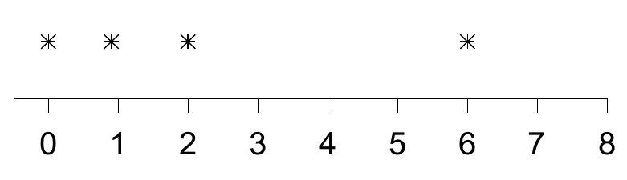
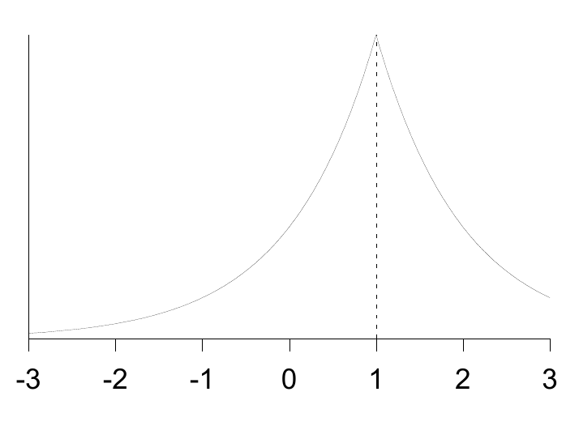

<!-- 原书 PDF 物理页 461；印刷页 449。页首承接 PDF460 的习题 35.8；含无编号观测值示意、图 35.2、35.5 节及习题 35.4 解答的式 (35.7)–(35.11)。解答末段跨 PDF462，已在本页合并。 -->

其中 $Z$ 是归一化常数，$Z=2$。均值 $\mu$ 未知。图 35.2 给出 $\mu=1$ 时这种分布的一个例子。假设四个数据点为

$$\{x_n\}=\{0,0.9,2,6\},$$

图内标记译注：数轴从 0 到 8，四个星号依次位于 $0$、$0.9$、$2$ 和 $6$。

这些数据告诉我们关于 $\mu$ 的什么信息？请在答案中画出详细草图，并给出 $\mu$ 的一个合理取值范围。

图 35.2。双指数分布 $P(x\mid\mu=1)$。

## 35.5　解答

**习题 35.4 的解答（第 446 页）。** 规模为 $N$ 的群体有 $N$ 次发生突变的机会。发生突变的次数 $r$，其概率大致服从泊松分布：

$$P(r\mid a,N)=e^{-aN}\frac{(aN)^r}{r!}.\tag{35.7}$$

（这稍有不准，因为一个突变体的后代不可能再次发生同一种突变。）每次突变最终产生的突变细胞数 $n_i$，取决于这次突变发生在哪一代。如果增殖像钟表一样严格同步，那么 $n_i=1$ 的概率为 $1/2$，$n_i=2$ 的概率为 $1/4$，$n_i=4$ 的概率为 $1/8$；对所有为 2 的整数次幂的 $n_i$，都有 $P(n_i)=1/(2n)$。但我们不认为突变体的后代会完全同步地分裂，而且也不知道实验结束的确切时间相对于细胞分裂时刻落在哪里。把上述分布平滑处理，使所有整数都可能出现，可得

$$P(n_i)=\frac{1}{Z}\frac{1}{n_i^2},\tag{35.8}$$

其中 $Z=\pi^2/6=1.645$。［这个分布的各阶矩都不对，因为 $n_i$ 不可能超过 $N$。但谁会在意矩呢？只有那些误入歧途的抽样理论统计学家：他们忙着构造“无偏估计量”，例如 $\hat a=(\bar n/N)/\log N$。我们用上述 $P(n_i)$ 近似给似然函数带来的误差可以忽略。］

观测到的突变细胞数 $n$ 是各次突变贡献的总和：

$$n=\sum_{i=1}^{r}n_i.\tag{35.9}$$

给定 $r$ 时，$n$ 的概率分布是 $r$ 个形如式 (35.8) 的相同分布的卷积。例如，

$$P(n\mid r=2)=\sum_{n_1=1}^{n-1}\frac{1}{Z^2}\frac{1}{n_1^2}\frac{1}{(n-n_1)^2}\quad\text{对 }n\geq2.\tag{35.10}$$

贝叶斯推断所需的、给定 $a$ 时 $n$ 的概率分布，可通过对 $r$ 求和得到：

$$P(n\mid a)=\sum_{r=0}^{N}P(n\mid r)P(r\mid a,N).\tag{35.11}$$

这个量无法解析地求出。但当 $a$ 很小时，从 $r=0$ 显式求和至某个 $r_{\max}$，就很容易达到任意所需的数值精度；同时针对所需的全部 $n$ 值，经过 $r_{\max}$ 次显式卷积，求出各个 $r$ 对应的 $P(n\mid r)$。如果令 $r_{\max}=n_{\max}$，其中 $n_{\max}$ 是数据中出现的最大 $n$ 值，那么算出的 $P(n\mid a)$ 就是精确值；但对本题的数据，$r_{\max}=9$ 已足以得到准确结果。我绘制图 35.3 时用了 $r_{\max}=74$。Octave 源代码可供获取。[^35-1]
