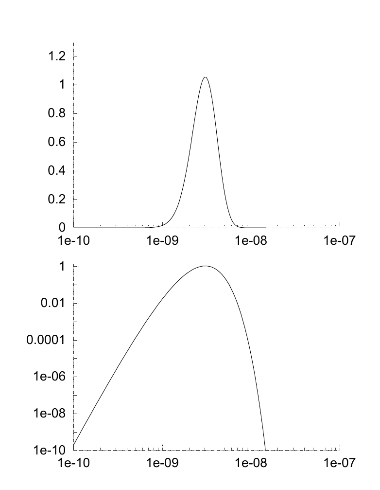

<!-- 原书 PDF 物理页 462；印刷页 450。页首承接 PDF461 的习题 35.4 解答末段，已在 PDF461 合并。本页含式 (35.12)–(35.15)、图 35.3、习题 35.5 解答及脚注 1。 -->

顺便说一下，对于本题这样零计数占相当比例的数据集，采用 Luria 和 Delbrück 的第二个近似也几乎不会损失什么信息。这个近似只保留 $n=0$ 的次数与 $n\ne0$ 的次数。用这样压缩后的数据集得到的似然函数是

$$L(a)=\bigl(e^{-aN}\bigr)^{11}\bigl(1-e^{-aN}\bigr)^9,\tag{35.12}$$

它与利用全部信息算出的似然函数几乎无法区分。

**习题 35.5 的解答（第 447 页）。** 从六个形如以下形式的项出发：

$$P(\mathbf F\mid\alpha\mathbf m)=\frac{\prod_i\Gamma(F_i+\alpha m_i)}{\Gamma(\sum_i F_i+\alpha)}\frac{\Gamma(\alpha)}{\prod_i\Gamma(\alpha m_i)},\tag{35.13}$$

大多数因子相互抵消，最后只剩下

$$\frac{P(\mathcal H_{A\to B}\mid\mathrm{Data})}{P(\mathcal H_{B\to A}\mid\mathrm{Data})}=\frac{(765+1)(235+1)}{(950+1)(50+1)}=\frac{3.8}{1}.\tag{35.14}$$

图 35.3。给定 Luria 和 Delbrück 的数据，突变率 $a$ 的似然，分别以线性刻度和对数刻度表示。纵轴：似然除以 $10^{-23}$；横轴：$a$。

这些结果为 $\mathcal H_{A\to B}$ 提供了适度的支持：在该假说下推断出的三个概率（约为 $0.95$、$0.8$ 和 $0.1$），比另一假说下推断出的三个概率（$0.24$、$0.008$ 和 $0.19$）更符合先验的典型取值。如果我们把先验看成对这三个概率的“均匀”先验，这句话听起来就很荒谬：在均匀先验下，概率的任何取值组合难道不都同样可能吗？但在自然的基底——logit 基底——中，先验正比于 $p(1-p)$，于是后验概率之比可估计为

$$\frac{0.95\times0.05\times0.8\times0.2\times0.1\times0.9}{0.24\times0.76\times0.008\times0.992\times0.19\times0.81}\simeq\frac31,\tag{35.15}$$

这个估计并不完全准确，但它确实说明了为什么结果更倾向于 $A\to B$。

[^35-1]: [www.inference.phy.cam.ac.uk/itprnn/code/octave/luria0.m](http://www.inference.phy.cam.ac.uk/itprnn/code/octave/luria0.m)
