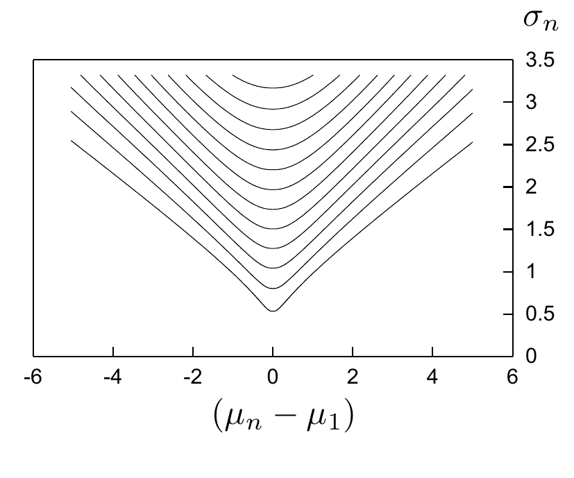

<!-- 原书 PDF 物理页 465；印刷页 453。含习题 36.3、式 (36.11)–(36.14)、图 36.1 及 36.2 节。式 (36.13) 的两个负号依印本保留，相关歧义见 SOURCE_NOTES。 -->

现在到了有意思的部分：我们应当勘探吗？在地点 $n_p$ 勘探之后，我们会按决策规则 (36.9) 选择地点，不过要把地点 $n_p$ 的均值 $\mu_{n_p}$ 换成式 (36.8) 给出的更新值 $\mu_n'$。问题有意思之处在于，我们还不知道 $d_n$ 的值，所以也不知道最后会采取哪项行动 $n_a$。事实上，勘探的全部价值，就来自勘探结果 $d_n$ 可能使我们改变行动：如果没有实验提供的信息，我们本会作出另一选择。

根据式 (36.8) 中新均值与 $d_n$ 的关系，以及式 (36.6) 中已知的 $d_n$ 方差，我们可以算出关键量 $\mu_n'$ 的概率分布；再对所有可能结果及其对应的行动积分，就能求出期望效用。

习题 36.3。（难度 2）证明：式 (36.8) 中的新均值 $\mu_n'$ 服从高斯分布，其均值为 $\mu_n$，方差为

$$s^2\equiv\sigma_n^2\frac{\sigma_n^2}{\sigma^2+\sigma_n^2}.\tag{36.11}$$

考虑在地点 $n$ 勘探。设其他地点中最大的均值为 $\mu_1$。获得新均值 $\mu_n'$ 后，如果 $\mu_n'>\mu_1$，我们会选择地点 $n$，其期望收益为 $\mu_n'$；如果 $\mu_n'<\mu_1$，则选择地点 1，期望收益为 $\mu_1$。

因此，先在地点 $n$ 勘探、再选出最优地点的期望效用是

$$\mathcal E[U\mid\text{在 }n\text{ 处勘探}]=-c_n+P(\mu_n'<\mu_1)\mu_1+\int_{\mu_1}^{\infty}\mathrm d\mu_n'\,\mu_n'\operatorname{Normal}(\mu_n';\mu_n,s^2).\tag{36.12}$$

我们关心的是勘探与不勘探的效用之差。它取决于如果不勘探我们会怎样做，而后者又取决于 $\mu_1$ 是否大于 $\mu_n$。

$$\mathcal E[U\mid\text{不勘探}]=\begin{cases}-\mu_1,&\text{若 }\mu_1\geq\mu_n,\\-\mu_n,&\text{若 }\mu_1\leq\mu_n.\end{cases}\tag{36.13}$$

于是，

$$\begin{aligned}&\mathcal E[U\mid\text{在 }n\text{ 处勘探}]-\mathcal E[U\mid\text{不勘探}]\\={}&\begin{cases}-c_n+\displaystyle\int_{\mu_1}^{\infty}\mathrm d\mu_n'\,(\mu_n'-\mu_1)\operatorname{Normal}(\mu_n';\mu_n,s^2),&\text{若 }\mu_1\geq\mu_n,\\-c_n+\displaystyle\int_{-\infty}^{\mu_1}\mathrm d\mu_n'\,(\mu_1-\mu_n')\operatorname{Normal}(\mu_n';\mu_n,s^2),&\text{若 }\mu_1\leq\mu_n.\end{cases}\end{aligned}\tag{36.14}$$

我们可以把勘探带来的期望效用变化（不计 $c_n$）画成关于两项量的函数：横轴是均值之差 $\mu_n-\mu_1$，纵轴是初始标准差 $\sigma_n$。图中噪声方差为 $\sigma^2=1$。

图 36.1。勘探带来的期望效用增益等高线图。各条等高线从 $0.1$ 到 $1.2$，相邻两条相差 $0.1$。要判断是否值得在地点 $n$ 勘探，找到数值等于 $c_n$（勘探成本）的等高线；位于该等高线上方的所有点 $[(\mu_n-\mu_1),\sigma_n]$，都值得勘探。图内横轴为 $\mu_n-\mu_1$，纵轴为 $\sigma_n$；所有数值刻度与等高线均保留。

## 36.2　延伸阅读

如果我们所处的世界比上面的勘探问题稍复杂一些——例如可以反复勘探多次，而且勘探成本不确定——那么，要算出探索（exploration）与利用（exploitation）之间的最优平衡，就难得多了。*强化学习（Reinforcement learning）*研究求解这类问题的近似方法（Sutton 和 Barto，1998）。
