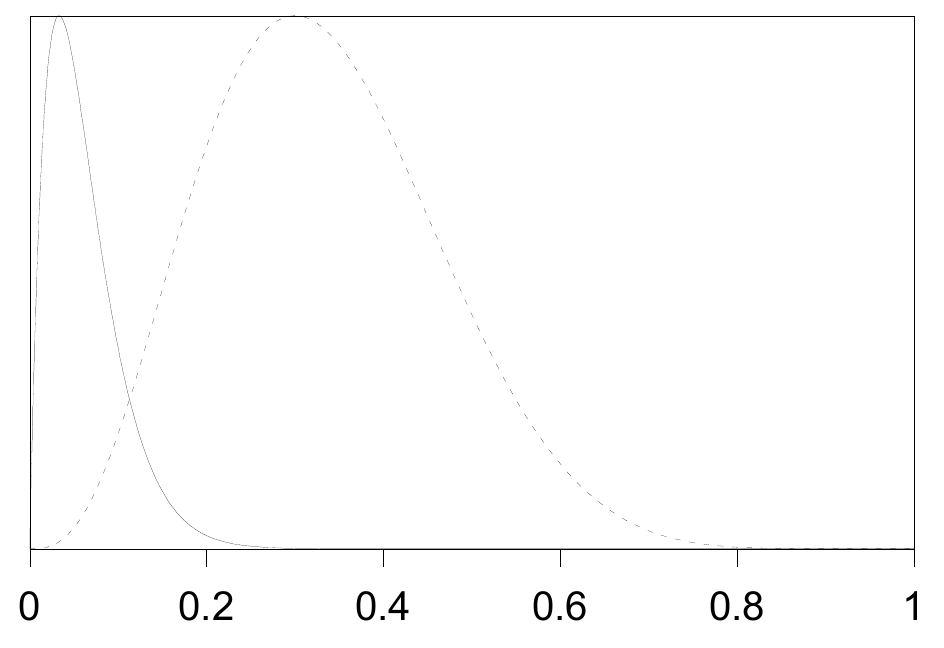
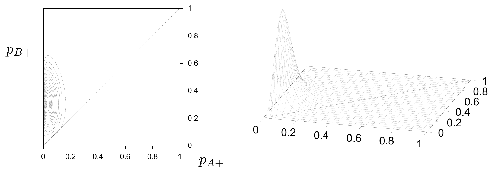
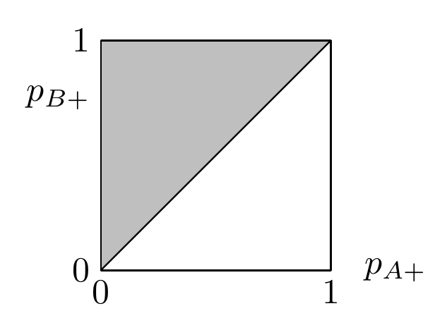
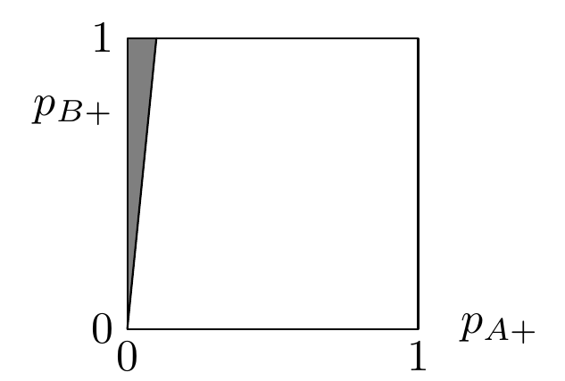

<!-- 原书 PDF 物理页 473；印刷页 461。§37.1：图 37.1–37.4、图注、图内坐标符号、后验概率结论与模型比较开端；页末有一张无编号 2×2 数据表。本页无编号公式。 -->

图 37.1。两种方案有效性的后验概率。方案 $A$ 为实线，方案 $B$ 为点线。图内横轴刻度从 0 到 1；两条线分别对应前句所述的方案 $A$ 和 $B$。

图 37.2。两种方案有效性的联合后验概率：等高线图和曲面图。图内等高线图的横轴为 $p_{A+}$，纵轴为 $p_{B+}$，刻度均从 0 到 1；右侧是同一联合概率的曲面图。

式 (37.16) 是对图 37.2 中的联合后验概率 $P(p_{A+},p_{B+}\mid\text{Data})$，在满足 $p_{A+}<p_{B+}$ 的区域上积分；这个区域就是图 37.3 中的阴影三角形。对式 (37.13) 的似然函数在相关区域进行直接数值积分，可得 $P(p_{A+}<p_{B+}\mid\text{Data})=0.990$。

图 37.3。阴影三角形中的所有点都满足 $p_{A+}<p_{B+}$。为了求出这一命题的概率，我们在这个区域上对图 37.2 的联合后验概率 $P(p_{A+},p_{B+}\mid\text{Data})$ 积分。图内横轴为 $p_{A+}$，纵轴为 $p_{B+}$，刻度均从 0 到 1。

因此，在给定数据和我们的先验假设的条件下，方案 $A$ 优于方案 $B$ 的概率是 $99\%$。总之，根据我们的贝叶斯模型，这组数据——接种 $A$ 后 30 人中 1 人患病，接种 $B$ 后 10 人中 3 人患病——提供了非常有力的证据，约为 99 比 1，表明方案 $A$ 优于方案 $B$。

采用贝叶斯方法，也很容易回答其他相关问题。例如，如果我们想知道“方案 $A$ 比方案 $B$ 有效十倍的可能性有多大？”，可以把联合后验概率 $P(p_{A+},p_{B+}\mid\text{Data})$ 在 $p_{A+}<10p_{B+}$ 的区域上积分（图 37.4）。

图 37.4。阴影三角形中的所有点都满足 $p_{A+}<10p_{B+}$。图内横轴为 $p_{A+}$，纵轴为 $p_{B+}$，刻度均从 0 到 1。

*模型比较*

如果我们真的遇到需要比较 $\mathcal H_0:p_{A+}=p_{B+}$ 与 $\mathcal H_1:p_{A+}\ne p_{B+}$ 这两个假设的情形，当然也可以直接用贝叶斯方法来比较。

例如，考虑以下数据集：

$D$：一名接受方案 $A$ 的受试者后来患上 *microsoftus*；一名接受方案 $B$ 的受试者没有患病。

<table>
<thead><tr><th>接种方案</th><th>A</th><th>B</th></tr></thead>
<tbody>
<tr><th>患病</th><td>1</td><td>0</td></tr>
<tr><th>未患病</th><td>0</td><td>1</td></tr>
<tr><th>接受方案的总人数</th><td>1</td><td>1</td></tr>
</tbody>
</table>
