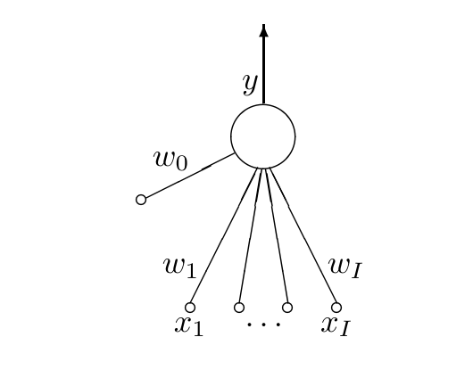
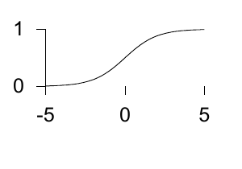

<!-- 原书 PDF 物理页 483；印刷页 471。第 39 章起页；含图 39.1、未编号逻辑函数曲线、式 (39.1)–(39.3)。 -->

# 第 39 章　作为分类器的单个神经元

> **编者导读（非原书正文）**　本章先定义单个神经元的输入、权重与输出，再把它用于二分类；随后讨论学习规则和正则化如何影响分类结果。

## 39.1　单个神经元

我们研究单个神经元有两个原因。第一，许多神经网络模型由单个神经元组成，因此有必要详细了解它们。第二，单个神经元本身就能够“学习”；事实上，各种标准统计方法都可以用单个神经元来理解。因此，这个模型将成为*监督式神经网络*（supervised neural network）的第一个例子。

*单个神经元的定义*

我们先定义单个神经元的结构和活动规则，然后推导学习规则。

图 39.1　单个神经元。图内符号：$x_1,\ldots,x_I$ 是输入，$w_1,\ldots,w_I$ 是对应的权重，$w_0$ 是偏置权重，$y$ 是输出。

**结构。** 单个神经元有 $I$ 个输入 $x_i$，以及一个输出，这里记为 $y$（见图 39.1）。每个输入都有一个对应的权重 $w_i$（$i=1,\ldots,I$）。神经元还可以有一个额外参数 $w_0$，称为偏置（bias）；可以把它看作与始终设为 $1$ 的输入 $x_0$ 对应的权重。单个神经元是一个前馈装置：连接方向从输入指向神经元的输出。

**活动规则。** 活动规则分两步。

**1.** 首先，给定施加的输入 $\mathbf x$，计算神经元的*激活量*（activation）：

$$a=\sum_i w_i x_i,\tag{39.1}$$

如果有偏置，求和范围是 $i=0,\ldots,I$；否则是 $i=1,\ldots,I$。

**2.** 其次，把输出 $y$ 设为激活量的函数 $f(a)$。输出也称为神经元的*活动量*（activity），不要把它与激活量 $a$ 混淆。激活函数（activation function）有多种选择；下面列出最常用的几种。

激活量 $a\;\longrightarrow\;$ 活动量 $y(a)$。

**(a) 确定性激活函数：**

**i. 线性函数。**

$$y(a)=a.\tag{39.2}$$

**ii. Sigmoid（逻辑函数）。**

$$y(a)=\frac{1}{1+e^{-a}}\qquad(y\in(0,1)).\tag{39.3}$$

