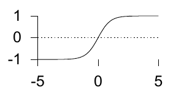
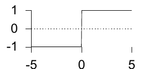

<!-- 原书 PDF 物理页 484；印刷页 472。§39.1 续、§39.2 起；含两幅未编号函数曲线、式 (39.4)–(39.9)、Metropolis 三行规则及推荐习题 39.1。 -->

**iii. Sigmoid（双曲正切函数）。**

$$y(a)=\tanh(a)\qquad(y\in(-1,1)).\tag{39.4}$$



**iv. 阈值函数。**

$$y(a)=\Theta(a)=\begin{cases}1& a>0\\-1& a\leq 0.\end{cases}\tag{39.5}$$



**(b) 随机激活函数：**$y$ 从 $\pm1$ 中随机选取。

**i. 热浴法（heat bath）。**

$$y(a)=\begin{cases}1&\text{以概率 }\dfrac{1}{1+e^{-a}}\\-1&\text{其他情况。}\end{cases}\tag{39.6}$$

**ii. Metropolis 规则。** 这一规则产生输出的方式取决于先前的输出状态 $y$：

```text
计算 Δ = ay
如果 Δ ≤ 0，把 y 翻转到另一状态
否则，以概率 e^(−Δ) 把 y 翻转到另一状态。
```

## 39.2　神经网络的基本概念

神经网络实现一个函数 $y(\mathbf x;\mathbf w)$；网络的“输出”$y$ 是“输入”$\mathbf x$ 的非线性函数，这个函数由“权重”$\mathbf w$ 参数化。

我们将研究一个单个神经元，它根据 $\mathbf x$ 通过下式产生介于 $0$ 和 $1$ 之间的输出：

$$y(\mathbf x;\mathbf w)=\frac{1}{1+e^{-\mathbf w\cdot\mathbf x}}.\tag{39.7}$$


**习题 39.1**（难度 1）我们此前在哪些情境中遇到过函数 $y(\mathbf x;\mathbf w)=1/(1+e^{-\mathbf w\cdot\mathbf x})$？

*线性逻辑函数的来由*

在第 11.2 节，我们研究过“脉冲的最佳检测”：假设两个信号 $\mathbf x_0$ 和 $\mathbf x_1$ 中的一个，经方差–协方差矩阵为 $\mathbf A^{-1}$ 的高斯信道传送。我们发现，给定收到的信号 $\mathbf y$，源信号为 $s=1$ 而非 $s=0$ 的概率是

$$P(s=1\mid\mathbf y)=\frac{1}{1+\exp(-a(\mathbf y))},\tag{39.8}$$

其中 $a(\mathbf y)$ 是收到的向量的线性函数，

$$a(\mathbf y)=\mathbf w^{\mathsf T}\mathbf y+\theta,\tag{39.9}$$

且 $\mathbf w\equiv\mathbf A(\mathbf x_1-\mathbf x_0)$。

线性逻辑函数还可以从另外几种角度得到解释，见习题。
