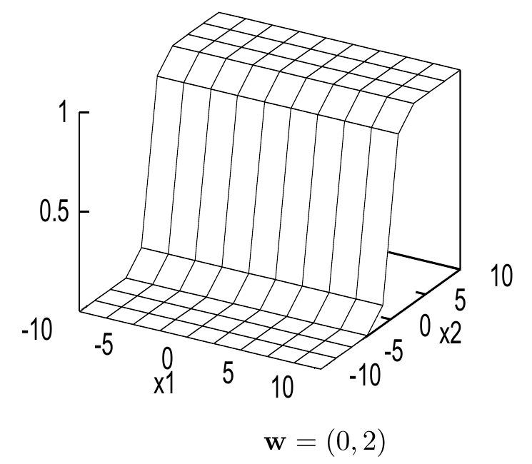

<!-- 原书 PDF 物理页 485；印刷页 473。§39.2 续，含图 39.2、式 (39.10) 及“输入空间与权重空间”小标题。 -->

图 39.2　简单神经网络的输出随输入变化的情况。图内横轴为 $x_1$ 和 $x_2$，纵轴为输出 $y$；所示权重为 $\mathbf w=(0,2)$。

*输入空间与权重空间*

为方便起见，我们研究输入向量 $\mathbf x$ 和参数向量 $\mathbf w$ 都是二维的情形：$\mathbf x=(x_1,x_2)$，$\mathbf w=(w_1,w_2)$。于是，神经元实现的函数可以明确写成

$$y(\mathbf x;\mathbf w)=\frac{1}{1+e^{-(w_1x_1+w_2x_2)}}.\tag{39.10}$$

图 39.2 展示了 $\mathbf w=(0,2)$ 时，神经元输出如何随输入向量变化。图中两条水平轴对应输入 $x_1$ 和 $x_2$，竖轴对应输出 $y$。注意：在任何与 $\mathbf w$ 垂直的直线上，输出都保持不变；沿 $\mathbf w$ 方向的直线上，输出则呈 sigmoid 函数形状。

现在引入*权重空间*（weight space）的概念，即网络的参数空间。在这个例子中有 $w_1$、$w_2$ 两个参数，所以权重空间是二维的。图 39.3 展示了这个权重空间：对于若干选定的参数向量 $\mathbf w$，其中的小插图显示权重取相应值时网络所实现的 $\mathbf x$ 的函数。每幅小插图都相当于图 39.2。因此，$\mathbf w$ 空间中的每个*点*对应 $\mathbf x$ 的一个*函数*。注意，随着 $\mathbf w$ 的模增大，sigmoid 函数的增益（斜坡的梯度）也会增大。

监督式神经网络的核心思想如下：给定输入向量 $\mathbf x$ 与目标值 $t$ 之间关系的若干*示例*，我们希望神经网络“学到”$\mathbf x$ 与 $t$ 之间关系的模型。训练成功的网络，对于任意给定的 $\mathbf x$，都会给出某种意义上接近目标值 $t$ 的输出 $y$。*训练*网络就是在网络的权重空间里寻找一个 $\mathbf w$，使它产生的函数能够很好地拟合给定的训练数据。

通常会定义一个关于 $\mathbf w$ 的*目标函数*（objective function）或*误差函数*（error function），用来衡量权重设为 $\mathbf w$ 时网络完成任务的好坏。目标函数由若干项相加构成，每个输入／目标值对 $\{\mathbf x,t\}$ 对应一项，用来衡量输出 $y(\mathbf x;\mathbf w)$ 与目标值 $t$ 有多接近。训练过程就是一个*函数最小化*问题：调整 $\mathbf w$，找出使目标函数最小的 $\mathbf w$。许多函数最小化算法不仅用到目标函数，还用到它相对于参数 $\mathbf w$ 的*梯度*。对一般的前馈神经网络，*反向传播*（backpropagation）算法能够高效地计算输出 $y$ 相对于参数 $\mathbf w$ 的梯度，进而计算目标函数相对于 $\mathbf w$ 的梯度。
