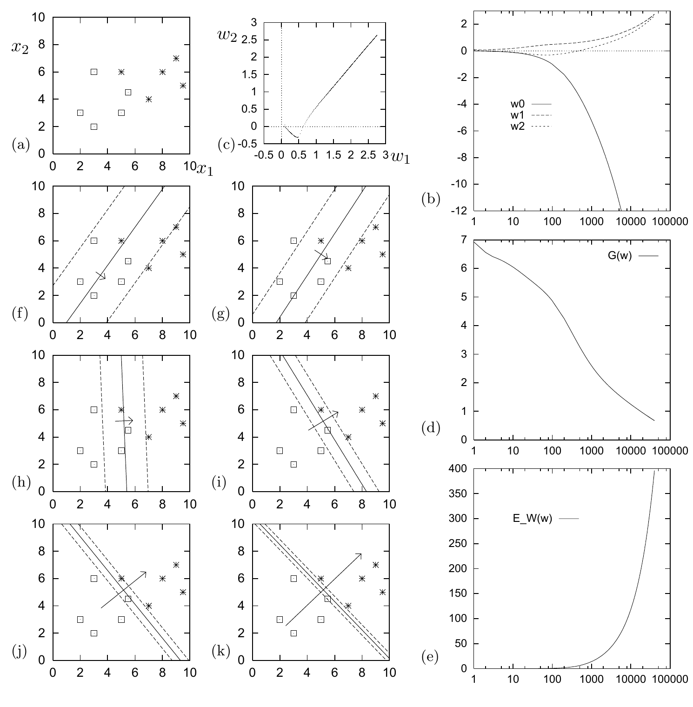

<!-- 原书 PDF 物理页 489；印刷页 477。整页为图 39.4，保留 (a)–(k) 十一个子图及图注中每项说明、学习率、迭代次数和等值线对应值。 -->

图 39.4　单个神经元通过梯度下降学习分类。这个神经元有两个权重 $w_1$、$w_2$ 和一个偏置 $w_0$。学习率设为 $\eta=0.01$，并使用算法 39.5 中的代码进行批量梯度下降。(a) 训练数据。(b) 权重 $w_0$、$w_1$、$w_2$ 随迭代次数变化的情况（横轴为对数刻度）。(c) 权重 $w_1$、$w_2$ 在权重空间中的变化轨迹。(d) 目标函数 $G(\mathbf w)$ 随迭代次数变化的情况。(e) 权重的大小 $E_W(\mathbf w)$ 随时间变化的情况。(f)–(k) 分别经过 30、80、500、3000、10 000 和 40 000 次迭代后，神经元所实现的函数（用三条等值线表示）。这些等值线对应 $a=0,\pm1$，也就是 $y=0.5,0.27,0.73$。图中还画出了与 $(w_1,w_2)$ 成正比的向量。权重越大，这个向量越长，等值线也越靠近。
