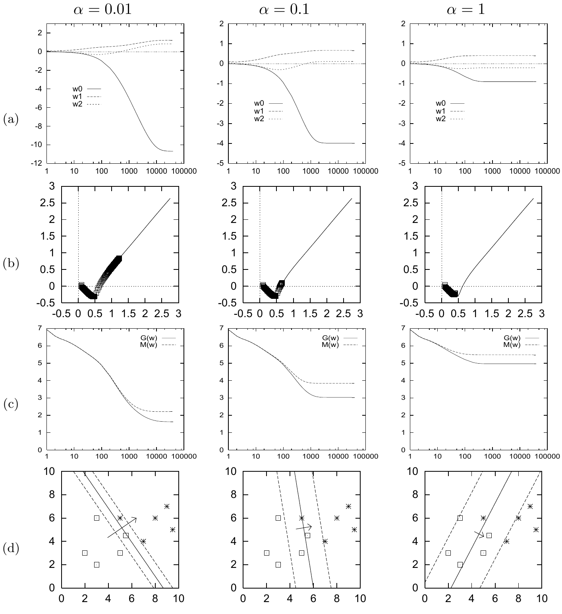

<!-- 原书 PDF 物理页 490；印刷页 478。含原书完整描边的 Octave 算法 39.5（代码语句不改、注释译为中文）及图 39.6 全部十二个子图和长图注。 -->

```octave
global x ;                # x 是包含全部输入向量的 N * I 矩阵
global t ;                # t 是包含全部目标值的长度为 N 的向量

for l = 1:L               # 循环 L 次

  a = x * w ;             # 计算全部激活量
  y = sigmoid(a) ;        # 计算输出
  e = t - y ;             # 计算误差
  g = - x' * e ;          # 计算梯度向量
  w = w - eta * ( g + alpha * w ) ; # 按学习率 eta 和权重衰减率 alpha 更新
endfor

function f = sigmoid ( v )
  f = 1.0 ./ ( 1.0 .+ exp ( - v ) ) ;
endfunction
```

算法 39.5　用于单个神经元批量学习的梯度下降优化器的 Octave 源代码，带可选的权重衰减（衰减率为 `alpha`）。Octave 记号：语句 `a = x * w` 将由全部输入向量构成的 $(N\times I)$ 矩阵 `x` 乘以权重向量 $\mathbf w$，得到列出全部 $N$ 个输入向量激活量的向量 `a`；`x'` 表示 `x` 的转置；一条语句 `y = sigmoid(a)` 就能计算向量 `a` 中所有元素的 sigmoid 函数值。



图 39.6　权重衰减对单个神经元学习的影响。目标函数为 $M(\mathbf w)=G(\mathbf w)+\alpha E_W(\mathbf w)$。学习方法与图 39.4 相同。(a) 权重 $w_0$、$w_1$、$w_2$ 的变化。(b) 权重 $w_1$、$w_2$ 在权重空间的变化：点表示加入权重衰减后的轨迹；细线（取自图 39.4）表示权重衰减为零时的轨迹。注意，对这个问题，权重衰减的作用与“提前停止”（early stopping）非常相似。(c) 目标函数 $M(\mathbf w)$ 和误差函数 $G(\mathbf w)$ 随迭代次数的变化。(d) 经过 40 000 次迭代后，神经元实现的函数。图内三列的衰减率分别为 $\alpha=0.01$、$\alpha=0.1$、$\alpha=1$；曲线图例中的 `w0`、`w1`、`w2` 分别对应 $w_0$、$w_1$、$w_2$。
