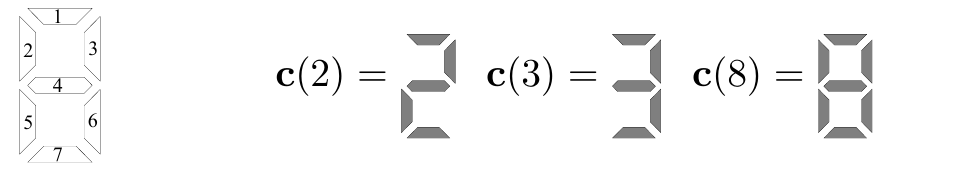
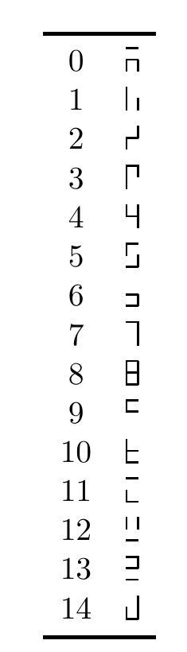

<!-- 原书 PDF 物理页 492；印刷页 480。§39.5 起，习题 39.4–39.5、式 (39.24)–(39.27)、LED 原图与表 39.7 的 0–14 全部15个字符；习题39.6起句跨页，整体置于 PDF493。 -->

## 39.5　进一步的习题

*线性神经元的其他来由*

▷ 习题 39.4。（难度 2）考虑这样一个任务：判断向量 $\mathbf z$ 来自两个高斯分布中的哪一个。与第 11.2 节研究的情形不同——那里两个分布的均值不同，但方差–协方差矩阵相同——这里假设两个分布的均值完全相同，而方差不同。令给定 $s$（$s\in\{0,1\}$）时 $\mathbf z$ 的概率为

$$P(\mathbf z\mid s)=\prod_{i=1}^{I}\operatorname{Normal}(z_i;0,\sigma_{si}^{2}),\tag{39.24}$$

其中 $\sigma_{si}^{2}$ 是源符号为 $s$ 时 $z_i$ 的方差。证明 $P(s=1\mid\mathbf z)$ 可以写成

$$P(s=1\mid\mathbf z)=\frac{1}{1+\exp(-\mathbf w^{\mathsf T}\mathbf x+\theta)},\tag{39.25}$$

其中 $x_i$ 是 $z_i$ 的某个适当函数，即 $x_i=g(z_i)$。

**习题 39.5**（难度 2）**有噪声的 LED 显示器。**

考虑一个由上图所示的 $7$ 个编号元件组成的 LED 显示器。显示器状态是向量 $\mathbf x$。当控制器想显示编号为 $s$ 的字符（例如 $s=2$）时，每个元件 $x_j$（$j=1,\ldots,7$）要么以概率 $1-f$ 呈现预期状态 $c_j(s)$，要么以概率 $f$ 翻转。把 $x$ 的两个状态称为“$+1$”和“$-1$”。

**(a)** 假设预期显示的字符 $s$ 实际上是 $2$ 或 $3$。给定显示状态 $\mathbf x$，$s$ 的概率是多少？证明 $P(s=2\mid\mathbf x)$ 可以写成

$$P(s=2\mid\mathbf x)=\frac{1}{1+\exp(-\mathbf w^{\mathsf T}\mathbf x+\theta)},\tag{39.26}$$

并在 $f=0.1$ 时求出权重 $\mathbf w$ 的值。

**(b)** 假设 $s$ 是 $\{0,1,2,\ldots,9\}$ 中的一个，先验概率为 $p_s$。给定状态 $\mathbf x$，$s$ 的概率是多少？把答案写成

$$P(s\mid\mathbf x)=\frac{e^{a_s}}{\sum_{s'}e^{a_{s'}}},\tag{39.27}$$

其中 $\{a_s\}$ 是 $\{c_j(s)\}$ 和 $\mathbf x$ 的函数。

表 39.7　七元件 LED 显示器的一种替代性 15 字符字母表。图内左列编号从 $0$ 到 $14$，右列逐一展示对应的亮灯段形。

你能为有噪声的 LED 设计一套更好的 10 字符字母表吗？也就是一套更不容易混淆的字母表？
