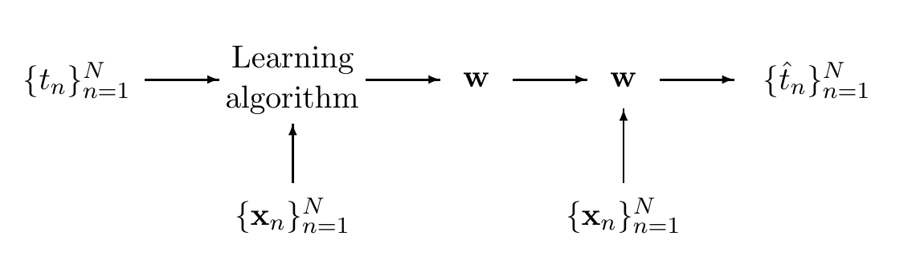

<!-- 原书 PDF 物理页 495；印刷页 483。第 40 章起页，含图 40.1、§40.1 与 §40.2 起。页末跨页段落完整译文放在 pdf-496.md。 -->

# 第 40 章　单个神经元的容量

> **编者导读（非原书正文）**　本章把神经网络学习看作一次通信，考察单个二值阈值神经元能记住多少信息。关键问题是：固定一组输入点后，它的权重能够表示多少种不同的二值标记。

图 40.1　把神经网络学习看作通信。图内“Learning algorithm”意为“学习算法”；左侧的目标值 $\{t_n\}_{n=1}^{N}$ 与输入点 $\{\mathbf x_n\}_{n=1}^{N}$ 进入学习算法，算法给出权重 $\mathbf w$；右侧利用同一组输入点和权重，产生重建值 $\{\hat t_n\}_{n=1}^{N}$。

## 40.1　把神经网络学习看作通信

许多神经网络模型会根据一组数据点调整一组权重 $\mathbf w$。例如，在给定的位置 $\{\mathbf x_n\}_{n=1}^{N}$，有 $N$ 个目标值组成的数据集 $D_N=\{t_n\}_{n=1}^{N}$。调整后的权重随后用于处理新的输入数据。这个过程可以看成一次通信：发送方查看数据 $D_N$，生成一条依赖于这些数据的消息 $\mathbf w$；接收方再使用 $\mathbf w$。例如，接收方可以试着用这组权重重建数据 $D_N$。［按神经网络的说法，这相当于用神经元作“记忆”，而不是作“泛化”；“泛化”是从已观察到的数据，推断新位置 $\mathbf x_{N+1}$ 处的值 $t_{N+1}$。］正如磁盘驱动器是一个通信信道，调整后的网络权重 $\mathbf w$ 也起着通信信道的作用：它把有关训练数据的信息传给神经网络未来的使用者。我们现在要问：“这个信道的容量是多少？”也就是：“训练一个神经网络，能存储多少信息？”

假如某种学习算法根据训练数据，只会产生两种网络之一：一种对所有输入都输出 $+1$，另一种对所有输入都输出 $0$。那么，权重只能帮助我们区分两类数据集。这种学习算法最多只能传递关于数据的 $1$ 比特信息；当两类数据集等概率出现时，才能达到这个信息量。如果充分利用神经网络表示其他函数的能力，又能多传递多少信息？

## 40.2　单个神经元的容量

我们先研究最简单的情形：单个二值阈值神经元。我们会发现，这样一个神经元的容量是*每个权重两比特*。有 $K$ 个输入的神经元，可以存储 $2K$ 比特的信息。
