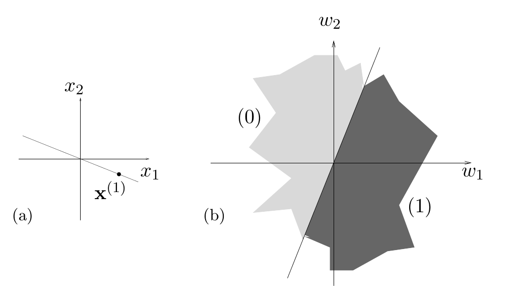

<!-- 原书 PDF 物理页 497；印刷页 485。§40.3 起；含图 40.2。页末跨页句在 pdf-498.md 衔接。 -->

图 40.2　二维输入空间中的一个数据点，以及权重空间中分别给这个点赋予两种标签的两个区域。图 (a) 的坐标为 $x_1,x_2$，黑点是 $\mathbf x^{(1)}$；图 (b) 的坐标为 $w_1,w_2$，浅色区域给它赋值 $0$，深色区域给它赋值 $1$。

## 40.3　阈值函数的计数

用 $T(N,K)$ 表示：在 $K$ 维空间中，对处于一般位置的 $N$ 个点，可以产生多少个不同的阈值函数。我们将推导 $T(N,K)$ 的公式。

先手工算几个例子。

*当 $K=1$ 时，任意 $N$*

这 $N$ 个点都在一条直线上。改变唯一的权重 $w_1$ 的符号，就可以把原点右侧的所有点标为 $1$、其余点标为 $0$，也可以反过来。因此只有两个不同的阈值函数：$T(N,1)=2$。

*当 $N=1$ 时，任意 $K$*

如果只有一个点 $\mathbf x^{(1)}$，取 $\mathbf w=\pm\mathbf x^{(1)}$，就能实现两种可能的标记。因此 $T(1,K)=2$。

*当 $K=2$ 时*

在二维空间中有 $N$ 个点时，我们可以让分隔直线绕原点旋转。每当直线扫过一个点，就得到一个新的函数。直线转过 $360$ 度后，会重新得到出发时的函数。由于这些点处于一般位置，分隔平面（在这里是一条直线）每次只扫过一个点。转一周，每个点都被扫过两次。因此共有 $2N$ 个不同的阈值函数：$T(N,2)=2N$。

二值函数总共有 $2^N$ 个。与这个总数相比可以看到：当 $N\geq3$ 时，线性阈值函数不能实现所有二值函数。一个著名的不可实现例子是 $N=4$、$K=2$，在 $\mathbf x=(\pm1,\pm1)$ 四个点上定义的异或函数。［这些点并不处于一般位置；但你可以验证，即使稍微扰动这些点，使其处于一般位置，异或函数仍然无法实现。］

*当 $K=2$ 时，从权重空间的角度看*

还有另一种观察这个问题的方法。我们不再看二维输入空间中分隔数据点的平面，而是看二维的*权重空间*：如果权重空间中的两个区域对给定数据点赋予不同标签，就用不同颜色表示它们。随后，数一数权重空间中有多少个可区分的区域，就得到了阈值函数的个数。
