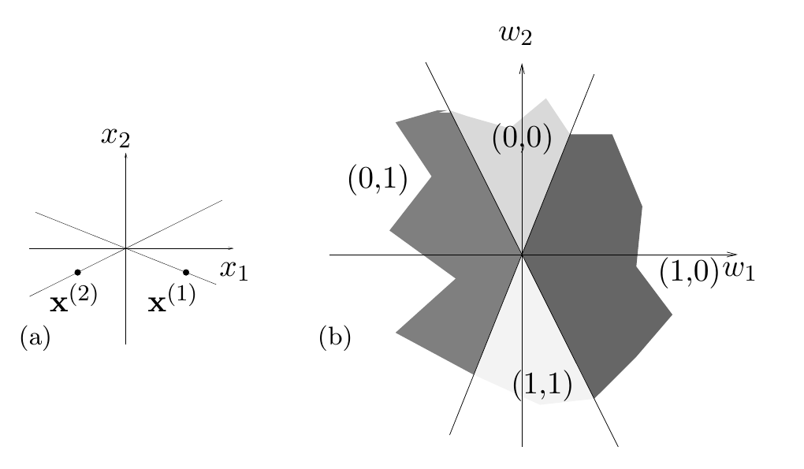
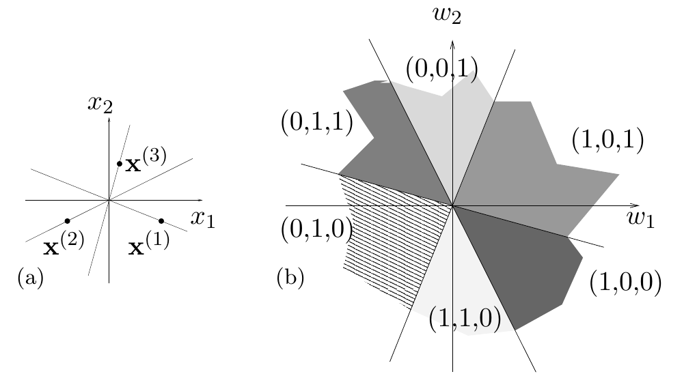

<!-- 原书 PDF 物理页 498；印刷页 486。§40.3 续；含图 40.3、40.4 及式 (40.3)。页末句跨过整页图版 PDF499，接于 PDF500。 -->

图 40.3　二维输入空间中的两个数据点，以及权重空间中产生四种不同标记的四个区域。图 (a) 标出 $\mathbf x^{(1)}$ 与 $\mathbf x^{(2)}$；图 (b) 的四个区域分别标为 $(0,0)$、$(0,1)$、$(1,0)$、$(1,1)$。

图 40.4　二维输入空间中的三个数据点，以及权重空间中产生六种标记的六个区域。在这里，标记 $(0,0,0)$ 与 $(1,1,1)$ 无法实现。对处于一般位置的任意三个点，总有两种标记无法实现。图 (a) 标出 $\mathbf x^{(1)}$、$\mathbf x^{(2)}$、$\mathbf x^{(3)}$；图 (b) 的六个区域标为 $(0,0,1)$、$(0,1,1)$、$(1,0,1)$、$(1,0,0)$、$(1,1,0)$、$(0,1,0)$。

先考虑权重空间中那些把某个样本 $\mathbf x^{(n)}$ 判为 $1$ 的权重向量。例如，图 40.2a 显示二维输入空间中的一个点，图 40.2b 显示权重空间中相应的两组点。一组权重向量占据半空间

$$\mathbf x^{(n)}\cdot\mathbf w>0,\tag{40.3}$$

另一组则占据 $\mathbf x^{(n)}\cdot\mathbf w<0$。在图 40.3a 中，我们向输入空间添加第二个点。现在有四种可能的标记：$(1,1)$、$(1,0)$、$(0,1)$ 和 $(0,0)$。图 40.3b 画出两个超平面 $\mathbf x^{(1)}\cdot\mathbf w=0$ 与 $\mathbf x^{(2)}\cdot\mathbf w=0$；它们把产生不同标记的权重向量集合分开。当 $N=3$ 时（图 40.4），三个超平面把权重空间分成六个区域。八种可设想的标记无法全部实现。因此 $T(3,2)=6$。

*当 $K=3$ 时*

现在用权重空间的图形来研究三维情形。

设想我们每次添加一个点，同时数一数阈值函数的个数。当 $N=2$ 时，两个超平面 $\mathbf x^{(1)}\cdot\mathbf w=0$ 与 $\mathbf x^{(2)}\cdot\mathbf w=0$ 把权重空间分成四个区域；在任一区域中，所有向量 $\mathbf w$ 对这两个输入向量产生相同的函数。因此 $T(2,3)=4$。

添加处于一般位置的第三个点，会在 $\mathbf w$ 空间中产生第三个平面，于是共有八个可区分的区域：$T(3,3)=8$。图 40.5a 画出了这三个分割平面。

此时，情况开始稍微复杂一些。如图 40.5b 所示，三维 $\mathbf w$ 空间中的第四个平面，不能把前三个平面形成的八个区域全部切开。已有区域中有六个被一分为二，其余两个不受影响。因此 $T(4,3)=14$。
