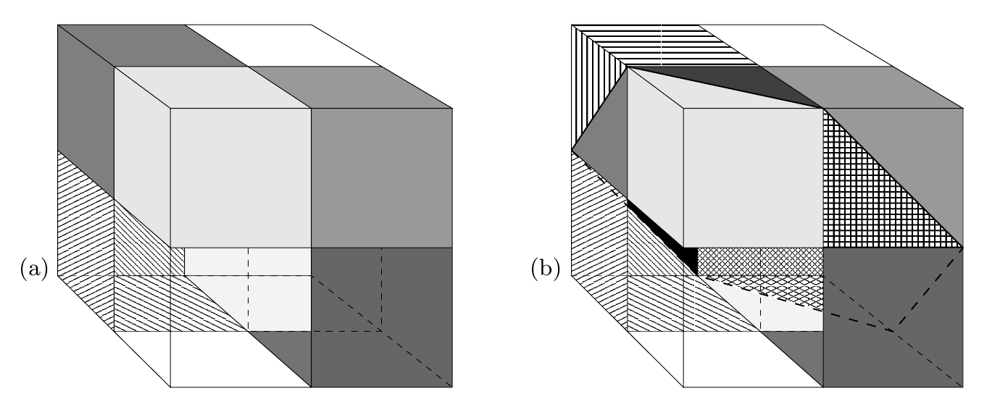
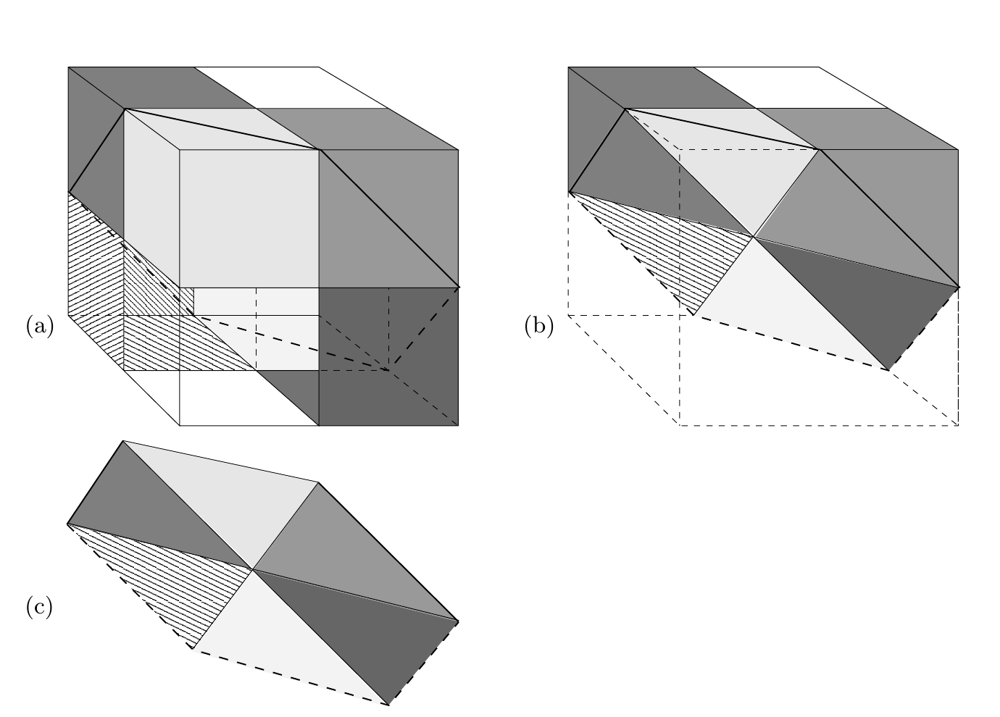

<!-- 原书 PDF 物理页 499；印刷页 487。整页由图 40.5、表 40.6、图 40.7 及其完整图表注组成，无正文段落。 -->

图 40.5　用于说明 $T(3,3)$ 和 $T(4,3)$ 的权重空间示意图。(a) $T(3,3)=8$。三个超平面（对应处于一般位置的三个点）把三维空间分成八个区域；图中通过给一个以原点为中心、中空且半透明的立方体表面的相关部分着色，显示这些区域。(b) $T(4,3)=14$。四个超平面把三维空间分成十四个区域，图中可见其中十三个（第十四个区域位于右侧面上，看不到）。与图 40.5a 相比：除白色以外，所有区域都被一分为二。

表 40.6　手工推得的 $T(N,K)$ 的值。原表空白单元格保持空白。

<table>
<thead><tr><th></th><th colspan="8">K</th></tr><tr><th>N</th><th>1</th><th>2</th><th>3</th><th>4</th><th>5</th><th>6</th><th>7</th><th>8</th></tr></thead>
<tbody>
<tr><td>1</td><td>2</td><td>2</td><td>2</td><td>2</td><td>2</td><td>2</td><td>2</td><td>2</td></tr>
<tr><td>2</td><td>2</td><td>4</td><td>4</td><td></td><td></td><td></td><td></td><td></td></tr>
<tr><td>3</td><td>2</td><td>6</td><td>8</td><td></td><td></td><td></td><td></td><td></td></tr>
<tr><td>4</td><td>2</td><td>8</td><td>14</td><td></td><td></td><td></td><td></td><td></td></tr>
<tr><td>5</td><td>2</td><td>10</td><td></td><td></td><td></td><td></td><td></td><td></td></tr>
<tr><td>6</td><td>2</td><td>12</td><td></td><td></td><td></td><td></td><td></td><td></td></tr>
</tbody>
</table>

图 40.7　从 $T(3,3)$ 到 $T(4,3)$ 的切分过程。(a) 在图 40.5a 的八个区域中加入一个超平面；所有非白色区域都被一分为二。(b) 这里把中空立方体画成实体，便于看清第四个平面切开了哪些区域；立方体的前半部分已移除。(c) 新的二维超平面被穿过它的三个一维超平面（直线）划分成六个区域。每个这样的区域都对应图 40.7a 中一个被新超平面切成两半的三维区域。这说明 $T(4,3)-T(3,3)=6$。请把图 40.7c 与图 40.4b 对照。
