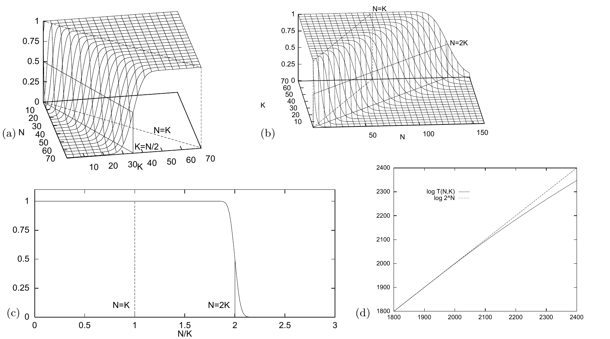

<!-- 原书 PDF 物理页 501；印刷页 489。含图 40.9 四面板、式 (40.8)–(40.9)，以及 VC 维的定义性讨论。 -->

图 40.9　在 $K$ 维空间的 $N$ 个点上，线性阈值函数占全部二值函数的比例 $T(N,K)/2^N$；这里从不同角度展示它。(a) 展示比例随 $K$ 的变化，近似为一个在 $K=N/2$ 处经过 $0.5$ 的误差函数；比例在 $K=N$ 时达到 $1$。(b) 展示比例随 $N$ 的变化：直到 $N=K$ 都是 $1$，在 $N=2K$ 处急剧下降。(c) 当 $K=1000$ 时，展示比例随 $N/K$ 的变化；在 $N=2K$ 处，可实现标记所占的比例骤降。(d) 当 $K=1000$ 时，展示 $\log_2 T(N,K)$ 与 $\log_2 2^N$ 随 $N$ 的变化。这些图用误差函数对 $T/2^N$ 的近似绘制。图内坐标和标线分别标有 $N$、$K$、$N/K$、$N=K$、$N=2K$（或 $K=N/2$）；(d) 中实线是 $\log T(N,K)$，虚线是 $\log 2^N$。

不过，也许我们可以把 $T(N,K)$ 表示成如下组合函数的线性叠加：$C_{\alpha,\beta}(N,K)\equiv {N+\alpha\choose K+\beta}$。比较表 40.8 和表 40.6，就能看出怎样满足边界条件：把帕斯卡三角形分别向右平移 $1,2,3,\ldots$ 格；把这些平移后的表叠加、相加，再乘以 $2$，最后把整张表向下移一行。于是

$$T(N,K)=2\sum_{k=0}^{K-1}{N-1\choose k}.\tag{40.8}$$

帕斯卡三角形的第 $N$ 行各项之和为 $2^N$，即 $\sum_{k=0}^{N-1}{N-1\choose k}=2^{N-1}$。利用这个事实，可以简化 $K-1\geq N-1$ 的情形：

$$T(N,K)=\begin{cases}2^N&K\geq N,\\2\displaystyle\sum_{k=0}^{K-1}{N-1\choose k}&K<N.\end{cases}\tag{40.9}$$

*解释*

自然可以把 $T(N,K)$ 与 $N$ 个点上的二值函数总数 $2^N$ 比较。比值 $T(N,K)/2^N$ 给出了这样一个概率：任意一组标记 $\{t_n\}_{n=1}^{N}$ 能被我们的神经元记住。当 $N\leq K$ 时，这两个函数相等。因此，直线 $N=K$ 是一条特殊的线：它确定了任意标记都能实现的最大点数。这个点数称为这一函数类的*Vapnik–Chervonenkis 维*（VC 维）。因此，$K$ 维空间中二值阈值函数的 VC 维是 $K$。
