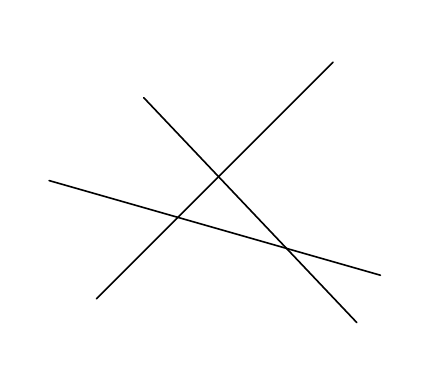

<!-- 原书 PDF 物理页 502；印刷页 490。含式 (40.10)、结论、§40.4、习题 40.4–40.8、图 40.10 及三处推荐习题图标。式 (40.10) 与 Φ 的印本细节见 SOURCE_NOTES.md。 -->

有意思的是：当 $K$ 很大时，几乎任意标记都能实现的点数 $N$ 可以有多大？当 $N<2K$ 时，比值 $T(N,K)/2^N$ 仍大于 $1/2$；当 $K$ 很大时，这个比值非常接近 $1$。

对我们的目的来说，式 (40.9) 中的和可以很好地用误差函数近似：

$$\sum_{0}^{K}{N\choose k}\simeq 2^N\Phi\!\left(\frac{K-(N/2)}{\sqrt N/2}\right),\tag{40.10}$$

其中 $\Phi(z)\equiv\int_{-\infty}^{z}\exp(-z^2/2)/\sqrt{2\pi}$。图 40.9 展示了可实现标记所占的比例 $T(N,K)/2^N$ 随 $N$ 和 $K$ 的变化。图 40.9c 传达的主要结论是：虽然当 $N>K$ 时，这个比例小于 $1$，但在 $N$ 增至 $2K$ 之前，它只比 $1$ 小很少；在 $N=2K$ 附近，这个比例急剧降向零。因此，当 $N>2K$ 时，阈值函数只能实现极少一部分二值标记。

*结论*

当 $K$ 很大时，线性阈值神经元的容量是每个权重 $2$ 比特。

单个神经元几乎肯定能够准确记住最多 $N=2K$ 个随机二值标签；超过这个数目，则几乎肯定无法记住。

## 40.4　补充习题

▷ 习题 40.4。（难度 2）二维空间中一组有限的 $2N$ 个互不相同的点，能否被一条直线均分：

- 如果这些点处于一般位置？
- 如果这些点不处于一般位置？

$K$ 维空间中的 $2N$ 个点，能否被一个 $(K-1)$ 维超平面均分？

 习题 40.5。（难度 2；解答见原书第 491 页）在球面上随机选取四个点。它们全部落在同一个半球上的概率是多少？这个问题与 $T(N,K)$ 有什么关系？

 习题 40.6。（难度 2）考虑 $K=3$ 维空间中的二值阈值神经元，以及点集 $\{\mathbf x\}=\{(1,0,0),(0,1,0),(0,0,1),(1,1,1)\}$。求参数向量 $\mathbf w$，使神经元记住以下标签：(a) $\{t\}=\{1,1,1,1\}$；(b) $\{t\}=\{1,1,0,0\}$。

再找出一种无法实现的标签 $\{t\}$。

▷ 习题 40.7。（难度 3）本章一直要求所有超平面都经过原点。在本题中，我们取消这个限制。

处于一般位置的 $N$ 条直线会把一个平面分成多少个区域？

图 40.10　平面中的三条直线产生七个区域。

 习题 40.8。（难度 2）估算你一生获得的全部感觉经验包含多少比特，包括视觉信息、听觉信息等。估算你记住了多少信息。估算莎士比亚作品的信息量。假设你的大脑有 $10^{11}$ 个神经元，每个神经元形成 $1000$ 个突触连接，而且单个神经元的容量结果（每个连接两比特）适用；把前述信息量与大脑的容量比较。你的大脑已经装满了吗？
