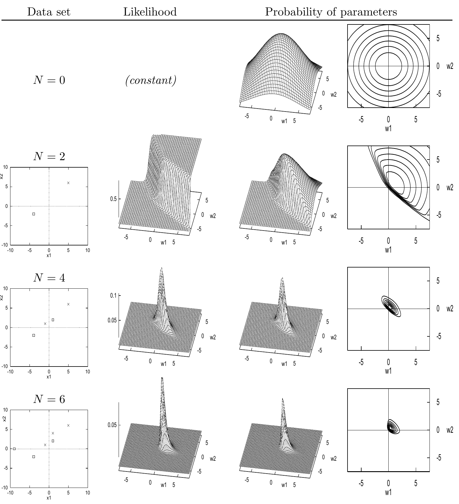
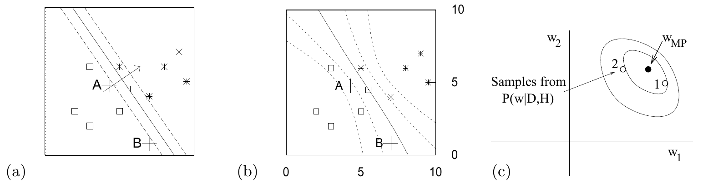

<!-- 原书 PDF 物理页 506；印刷页 494。整页由图 41.1、图 41.2 与完整图注组成；无正文段落或编号式。 -->

图 41.1　传统神经网络学习的贝叶斯解释及推广：随着数据到来，参数上的概率分布如何变化。图内列标题“Data set”是“数据集”，“Likelihood”是“似然”，“Probability of parameters”是“参数的概率”；四行依次是 $N=0,2,4,6$。$N=0$ 行的“constant”意为“常数”。各图的输入坐标为 $x_1,x_2$，参数坐标为 $w_1,w_2$。

图 41.2　作出预测。(a) 使用权重衰减 $\alpha=0.01$ 训练的优化神经元 $\mathbf w_{\mathrm{MP}}$ 所实现的函数，以其中三条等高线表示（来自图 39.6）。这些等高线对应 $a=0,\pm1$，也就是 $y=0.5,0.27,0.73$。(b) 这些预测是否更合理？图中的等高线对应 $y=0.5,0.27,0.73,0.12,0.88$。(c) $\mathbf w$ 的后验概率示意图；(b) 中的贝叶斯预测，是把权重 $\mathbf w$ 的每一种可能取值作出的预测平均起来得到的，其中每种取值的投票权重与它在后验集合中的概率成正比。生成 (b) 的方法将在第 41.4 节介绍。图内“Samples from $P(\mathbf w\mid D,H)$”意为“从 $P(\mathbf w\mid D,H)$ 中抽取的样本”；$A$、$B$ 是两处待预测的位置，$\mathbf w_{\mathrm{MP}}$ 是最大后验参数的位置。
