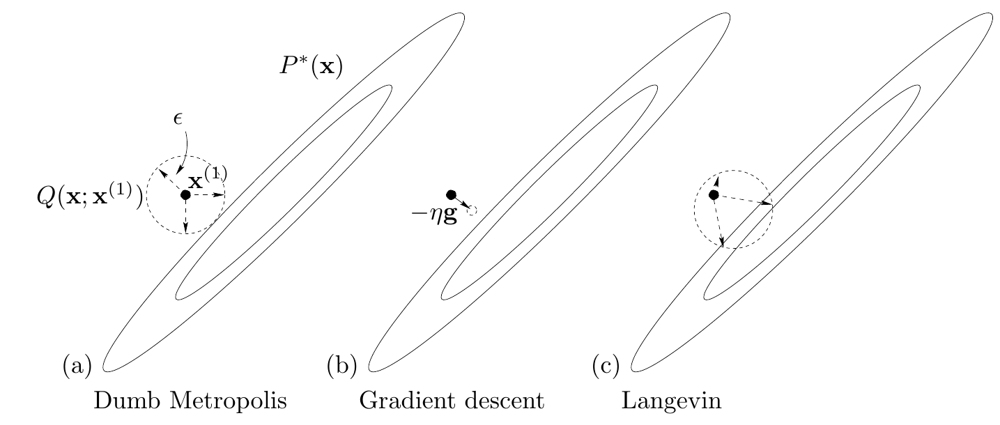

<!-- 原书 PDF 物理页 508；印刷页 496。图 41.3，§41.3 续、§41.4 起，式 (41.19)。原页末段跨至 PDF509。 -->

图 41.3　二维空间中 Langevin 方法的一步移动 (c)，与传统的“盲目”Metropolis 方法 (a) 及梯度下降 (b) 对照。Langevin 方法的提议分布可理解为“加入噪声的梯度下降”。图内文字：(a) Dumb Metropolis＝盲目 Metropolis 方法；(b) Gradient descent＝梯度下降；(c) Langevin＝Langevin 方法；$P^*(\mathbf x)$ 为目标分布，$Q(\mathbf x;\mathbf x^{(1)})$ 为从 $\mathbf x^{(1)}$ 出发的提议分布，$\epsilon$ 为提议尺度，$-\eta\mathbf g$ 为沿负梯度方向的移动量。

*实现*

怎样计算积分 (41.18)？对于这个玩具问题，权重空间是三维的；对于真实的神经网络，维数 $K$ 可能高达数千。

一般数据建模问题中的贝叶斯推断，可以用精确方法（第 25 章）、蒙特卡罗抽样（第 29 章）或确定性近似方法来实现。例如，可以使用 Laplace 方法（第 27 章）或变分方法（第 33 章）对 $P(\mathbf w\mid D,\alpha)$ 作高斯近似。对神经网络来说，精确方法很少。实现神经网络贝叶斯推断的两条主要路径，是 Neal（1996）发展的蒙特卡罗方法，以及 MacKay（1991）发展的高斯近似方法。

## 41.4　单个神经元的蒙特卡罗实现

我们先使用蒙特卡罗方法：把 $y(\mathbf x^{(N+1)};\mathbf w)$ 看作 $\mathbf w$ 的函数 $f$，通过计算它的均值来求解积分 (41.18)：

$$\langle f(\mathbf w)\rangle\simeq\frac{1}{R}\sum_r f(\mathbf w^{(r)}),\tag{41.19}$$

其中，$\{\mathbf w^{(r)}\}$ 是从后验分布 $Z_M^{-1}\exp(-M(\mathbf w))$ 抽取的样本（参见式 (29.6)）。我们用 Metropolis 方法（第 29.4 节）获取这些样本。顺便说一句，这种蒙特卡罗方法可能有个缺点：如果某个低概率事件最可能与低概率的参数值一起出现，那么该方法不擅长估计这个事件的概率，也就是不擅长估计非常接近零的 $P(t\mid D,\mathcal H)$。

怎样生成样本 $\{\mathbf w^{(r)}\}$？Radford Neal 将*哈密顿蒙特卡罗方法*（Hamiltonian Monte Carlo）引入了神经网络。我们在第 30 章遇到过这种利用梯度信息的精巧 Metropolis 方法。下面要演示的是它的一个简单版本，称为 *Langevin 蒙特卡罗方法*（Langevin Monte Carlo method）。

*Langevin 蒙特卡罗方法*

Langevin 方法（算法 41.4）可以概括为“加入噪声的梯度下降”，图 41.3 对此作了示意。从方差为 $1$ 的高斯分布生成噪声向量 $\mathbf p$，并计算梯度 $\mathbf g$。
