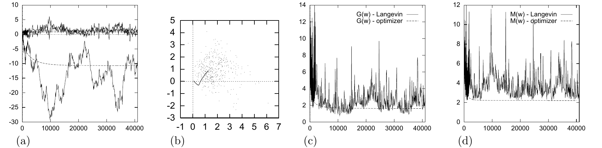

<!-- 原书 PDF 物理页 510；印刷页 498。含图 41.5 的四幅子图及完整图注、式 (41.20)、§41.4 三个斜体小标题中的后两个。图注 (d) 的 M(x) 照印本。 -->

图 41.5　单个神经元用 Langevin 蒙特卡罗方法学习的过程。(a) 权重 $w_0$、$w_1$、$w_2$ 随迭代次数的变化。(b) 权重 $w_1$、$w_2$ 在权重空间中的变化；线条还显示了使用图 39.6 的优化器时权重的变化。(c) 误差函数 $G(\mathbf w)$ 随迭代次数的变化；同时显示了图 39.6 的优化过程中误差函数的变化。(d) 目标函数 $M(\mathbf x)$ 随迭代次数的变化。另见图 41.6 和图 41.7。图内图例“$G(w)$ - Langevin／optimizer”分别表示 Langevin 方法／优化器下的误差函数曲线；“$M(w)$ - Langevin／optimizer”分别表示两种方法下的目标函数曲线。

然后按下式在 $\mathbf w$ 上迈出一步：

$$\Delta\mathbf w=-\frac{1}{2}\epsilon^2\mathbf g+\epsilon\mathbf p.\tag{41.20}$$

注意，如果去掉 $\epsilon\mathbf p$ 项，它就只是学习率 $\eta=\frac{1}{2}\epsilon^2$ 的梯度下降。是否接受这一步，取决于目标函数 $M(\mathbf w)$ 的值和梯度如何变化；接受概率的选取保证满足细致平衡。

Langevin 方法只有一个自由参数 $\epsilon$，它控制典型的步长。$\epsilon$ 设得太大，提议的移动可能被拒绝；设得很小，在状态空间中移动就会很慢。

*Langevin 方法的演示*

图 41.5、图 41.6 和图 41.7 演示了 Langevin 方法。这里的目标函数是 $M(\mathbf w)=G(\mathbf w)+\alpha E_W(\mathbf w)$，其中 $\alpha=0.01$。为便于比较，这些图还包含了以前用梯度下降法优化同一目标函数所得的结果（图 39.6）。可以看出，$\mathbf w$ 的平均变化趋势与梯度下降时参数的变化相似。约经过 10 000 次迭代后，蒙特卡罗方法似乎收敛到了后验分布。

这次模拟的平均接受率是 $93\%$；只有 $7\%$ 的提议移动被拒绝。如果使用更大的步长 $\epsilon$，很可能在状态空间中移动得更快；但这里选取的 $\epsilon$，使“下降速率”$\eta=\frac{1}{2}\epsilon^2$ 与前面模拟的步长相匹配。

*作出贝叶斯预测*

从第 10 000 次到第 40 000 次迭代，每隔 1 000 次抽取一次权重；相应的、以 $\mathbf x$ 为自变量的函数画在图 41.6 中。可信的函数有相当多种。把这 30 个以 $\mathbf x$ 为自变量的函数取平均，就得到了贝叶斯预测的蒙特卡罗近似。结果见图 41.7，并与优化参数给出的预测作了比较。离开数据最密集的区域后，贝叶斯预测适当地变得更温和。
