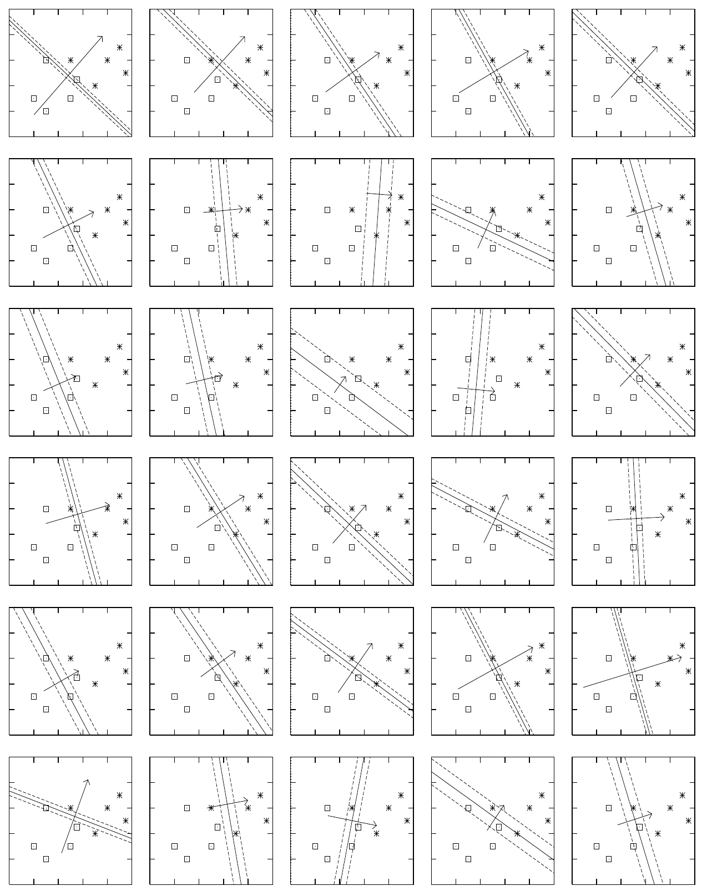
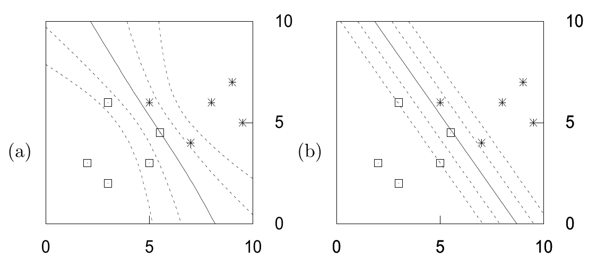

<!-- 原书 PDF 物理页 511；印刷页 499。仅有图 41.6（6×5 共 30 个子图）和图 41.7（a、b 两图）及各自完整图注，无正文或公式。 -->

图 41.6　Langevin 蒙特卡罗方法得到的样本。学习率设为 $\eta=0.01$，权重衰减率设为 $\alpha=0.01$。步长为 $\epsilon=\sqrt{2\eta}$。从第 10 000 次到第 40 000 次迭代，每隔 1 000 次，用三条等高线画出神经元实现的函数。这些等高线对应 $a=0,\pm1$，即 $y=0.5,0.27,0.73$。图中还画出了一个与 $(w_1,w_2)$ 成正比的向量。

图 41.7　比较 Langevin 蒙特卡罗方法得到的贝叶斯预测与使用优化后参数得到的预测。(a) 对图 41.6 中第 10 000 次到第 40 000 次迭代之间均匀选取的 30 个样本的预测求平均，得到预测函数。图中等高线对应 $a=0,\pm1,\pm2$，即 $y=0.5,0.27,0.73,0.12,0.88$。(b) 作为对照，图中画出了通过优化 $M(\mathbf w)$ 得到的神经元“最可能”参数所给出的预测。
