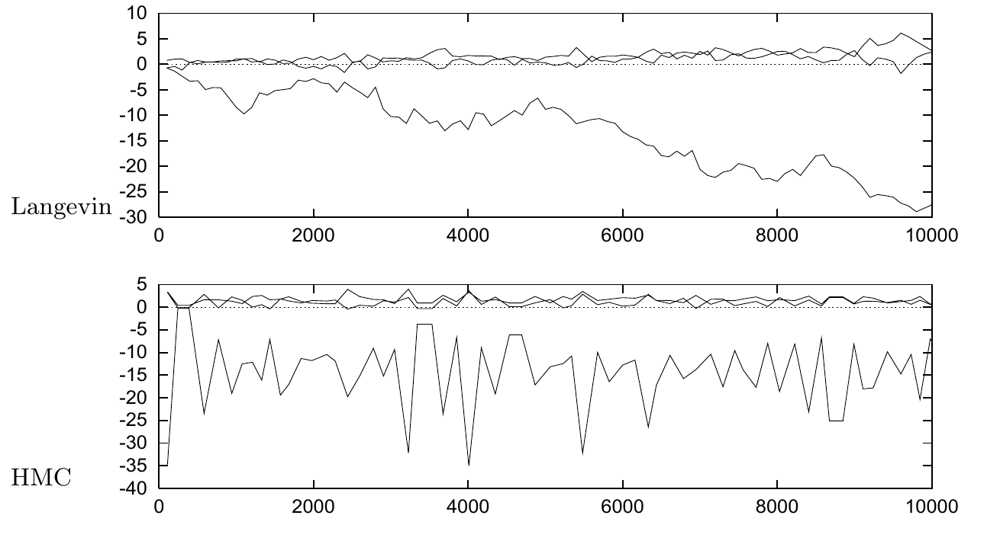

<!-- 原书 PDF 物理页 512；印刷页 500。含原书描边算法 41.8、图 41.9、两处斜体小标题及末段跨 PDF513；无编号公式。 -->

```octave
wnew = w ;
gnew = g ;
for tau = 1:Tau

   p = p - epsilon * gnew / 2 ;       # p 走半步
   wnew = wnew + epsilon * p ;        # w 走一步

   gnew = gradM ( wnew ) ;            # 计算新的梯度
   p = p - epsilon * gnew / 2 ;       # p 再走半步

endfor
```

算法 41.8　哈密顿蒙特卡罗方法的 Octave 源代码。该算法与算法 41.4 中的 Langevin 方法完全相同，只需用这里的代码片段替换算法 41.4 中标有 `*` 的四行。



图 41.9　比较 Langevin 蒙特卡罗方法与哈密顿蒙特卡罗（HMC）方法的抽样性质。横轴表示已进行的梯度计算次数。每幅图都显示了前 10 000 次迭代中的权重。此次哈密顿蒙特卡罗模拟的拒绝率为 $8\%$。图内“Langevin”指 Langevin 方法，“HMC”指哈密顿蒙特卡罗方法。

贝叶斯分类器更能识别分类结果不确定的位置。这种令人满意的表现，仅仅来自机械地应用概率规则。

*优化与典型性*

最后，再比较蒙特卡罗抽样过程中函数 $G(\mathbf w)$ 和 $M(\mathbf w)$ 的表现，与最优点 $\mathbf w_{\mathrm{MP}}$ 处 $G$ 和 $M$ 的取值（图 41.5）。$G(\mathbf w)$ 在 $G(\mathbf w_{\mathrm{MP}})$ 附近波动，虽然波动并不对称。$M(\mathbf w)$ 也会波动，但并非*围绕* $M(\mathbf w_{\mathrm{MP}})$ 波动——显然不可能，因为 $M$ 在 $\mathbf w_{\mathrm{MP}}$ 处达到最小值，不会再降得更低；况且 $M$ 很少接近 $M(\mathbf w_{\mathrm{MP}})$。用信息论的语言说，*$\mathbf w$ 的典型集合所具有的性质，不同于最可能状态 $\mathbf w_{\mathrm{MP}}$ 的性质。*

由此得到一条适用于所有数据模型，而非仅限神经网络的普遍结论：使用*优化后*的参数时应当谨慎，因为它们的性质可能不能代表典型的、可信的参数；而仅用优化后的参数作预测，往往会产生不合理的过度自信。

*用哈密顿蒙特卡罗减少随机游走行为*

最后考察蒙特卡罗方法时，我们比较 Langevin 蒙特卡罗方法与它的“大哥”——哈密顿蒙特卡罗方法。改用哈密顿蒙特卡罗方法很容易实现，如算法 41.8 所示。每一次提议都要进行多次梯度计算。
