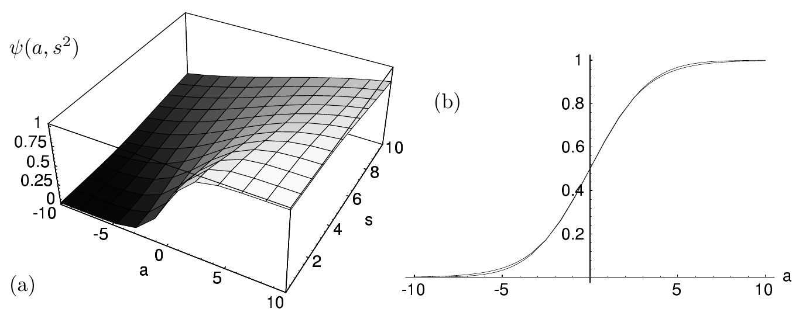
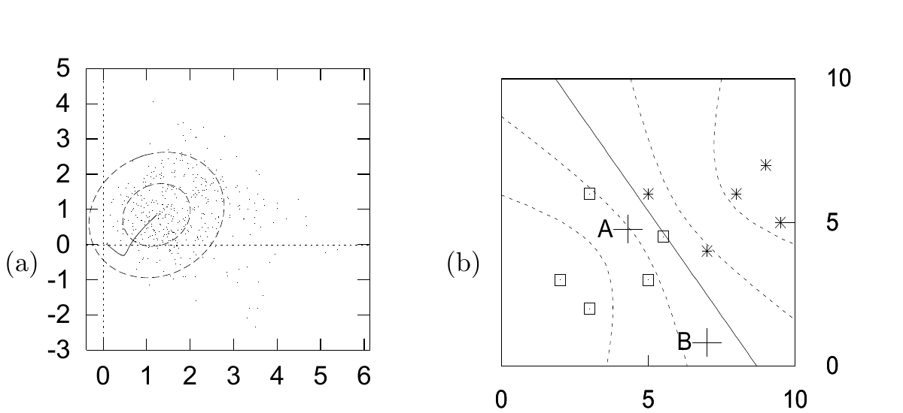

<!-- 原书 PDF 物理页 514；印刷页 502。图 41.10、41.11 及完整图注，§41.5 续，习题 41.2，式 (41.28)–(41.30)，页末段跨 PDF515。 -->

图 41.10　边缘化后的概率及其近似。(a) 通过数值计算得到的函数 $\psi(a,s^2)$。(b) 当 $s^2=4$ 时，正文定义的 $\psi(a,s^2)$ 和 $\phi(a,s^2)$ 随 $a$ 变化的曲线。引自 MacKay（1992b）。图内纵轴 $\psi(a,s^2)$ 为边缘化后的概率；$a$ 是激活量，$s$ 是其标准差。

图 41.11　权重空间中的高斯近似，以及它在输入空间中的近似预测。(a) 高斯近似投影到权重空间的 $(w_1,w_2)$ 平面，画出相距一个和两个标准差的等高线；图中还显示了优化器的轨迹和蒙特卡罗方法得到的样本。(b) 使用高斯近似和式 (41.30) 得到的预测函数（参见图 41.2）。图内的 $A$、$B$ 为两处输入位置。

*计算边缘化后的概率*

输出 $y(\mathbf x;\mathbf w)$ 对 $\mathbf w$ 的依赖，只通过标量 $a(\mathbf x;\mathbf w)$ 体现，因此可以先求 $a$ 的概率密度，以降低积分的维数。我们假定 $\mathbf w=\mathbf w_{\mathrm{MP}}+\Delta\mathbf w$ 的后验概率分布在局部近似为高斯分布：$P(\mathbf w\mid D,\alpha)\simeq (1/Z_Q)\exp(-\frac{1}{2}\Delta\mathbf w^{\mathsf T}\mathbf A\Delta\mathbf w)$。对这个单神经元来说，激活量 $a(\mathbf x;\mathbf w)$ 是 $\mathbf w$ 的线性函数，且 $\partial a/\partial\mathbf w=\mathbf x$；所以对任意 $\mathbf x$，激活量 $a$ 都服从高斯分布。

▷ 习题 41.2。（难度 2）设 $\mathbf w$ 服从均值为 $\mathbf w_{\mathrm{MP}}$、方差－协方差矩阵为 $\mathbf A^{-1}$ 的高斯分布。证明 $a(\mathbf x)$ 的概率分布为

$$P(a\mid\mathbf x,D,\alpha)=\operatorname{Normal}(a_{\mathrm{MP}},s^2)=\frac{1}{\sqrt{2\pi s^2}}\exp\left(-\frac{(a-a_{\mathrm{MP}})^2}{2s^2}\right),\tag{41.28}$$

其中 $a_{\mathrm{MP}}=a(\mathbf x;\mathbf w_{\mathrm{MP}})$，$s^2=\mathbf x^{\mathsf T}\mathbf A^{-1}\mathbf x$。

这意味着边缘化后的输出是：

$$P(t=1\mid\mathbf x,D,\alpha)=\psi(a_{\mathrm{MP}},s^2)\equiv\int\mathrm da\,f(a)\operatorname{Normal}(a_{\mathrm{MP}},s^2).\tag{41.29}$$

应将它与最可能的神经网络的输出 $y(\mathbf x;\mathbf w_{\mathrm{MP}})=f(a_{\mathrm{MP}})$ 区分开。sigmoid 函数与高斯分布乘积的积分，可以近似为：

$$\psi(a_{\mathrm{MP}},s^2)\simeq\phi(a_{\mathrm{MP}},s^2)\equiv f\bigl(\kappa(s)a_{\mathrm{MP}}\bigr),\tag{41.30}$$

其中 $\kappa=1/\sqrt{1+\pi s^2/8}$（图 41.10）。

*演示*

图 41.11 给出在最优点 $\mathbf w_{\mathrm{MP}}$ 拟合高斯近似的结果。
