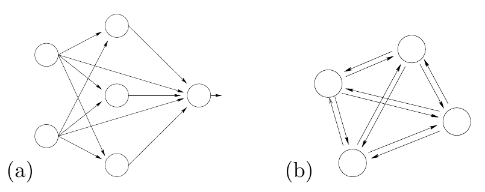

<!-- 原书 PDF 物理页 517；印刷页 505。第 42 章起页；图 42.1、§42.1 起及式 (42.1)。页末“刺激 m/n”段跨 PDF518。 -->

# 第 42 章　Hopfield 网络

> **编者导读（非原书正文）**　本章从神经元之间的反馈连接出发，介绍 Hopfield 网络的状态更新、联想记忆和优化用途。阅读时可以留意两件事：对称权重如何约束网络，以及不同的更新顺序会怎样影响状态的变化。

我们已经用三章研究单个神经元。现在该把多个神经元连接起来，让一个神经元的输出成为另一个神经元的输入，从而组成神经网络。

按照连接方式，神经网络可以分为两类。

图 42.1　(a) 前馈网络（feedforward network）；(b) 反馈网络（feedback network）。图中的箭头表示连接的方向。

**前馈网络。** 前馈网络中的所有连接都有方向，而且整个网络构成一个有向无环图。

**反馈网络。** 任何不是前馈网络的网络，都称为反馈网络。

本章要讨论一种称为 Hopfield 网络的全连接反馈网络。Hopfield 网络的权重必须*对称*，也就是说，神经元 $i$ 到神经元 $j$ 的权重，等于神经元 $j$ 到神经元 $i$ 的权重。

Hopfield 网络有两种用途：一是充当*联想记忆*（associative memory），二是求解*优化问题*。我们先讨论联想记忆的思想，它也叫内容寻址存储器（content-addressable memory）。

## 42.1　赫布学习

第 38 章讨论过传统数字存储器与生物记忆的差别。其中最显著的差别，也许是生物记忆的*联想性*。

Donald Hebb（1949）提出了一个体现联想记忆思想的简单模型。设想让活动*正相关*的神经元之间的权重*增大*：

$$\frac{\mathrm dw_{ij}}{\mathrm dt}\sim\operatorname{Correlation}(x_i,x_j).\tag{42.1}$$

现在设想，刺激 $m$ 出现时（例如闻到香蕉气味），神经元 $m$ 的活动增强。
