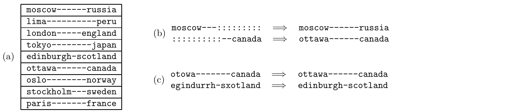

<!-- 原书 PDF 物理页 519；印刷页 507。图 42.2 的九条记忆与四个补全/纠错例子、式 (42.5)–(42.8)、推荐习题 42.1/42.2、§42.3 全文与 §42.4 起。 -->

图 42.2　联想记忆示意。(a) 一份希望存储的记忆列表。(b) 联想记忆的第一项用途：给出部分模式后完成模式。(c) 联想记忆的第二项用途：纠正记忆中的错误。图内列表依次是“莫斯科—俄罗斯、利马—秘鲁、伦敦—英格兰、东京—日本、爱丁堡—苏格兰、渥太华—加拿大、奥斯陆—挪威、斯德哥尔摩—瑞典、巴黎—法国”；(b) 中只给出 `moscow` 或 `canada` 的部分字符串，分别补全为“莫斯科—俄罗斯”和“渥太华—加拿大”；(c) 中含错字的 `otowa` 和 `egindurrh-sxotland`，分别纠正为“渥太华—加拿大”和“爱丁堡—苏格兰”。图内连续短横线用于对齐字符，冒号表示缺失的字符。

权重由*外积之和*或*赫布规则*设定：

$$w_{ij}=\eta\sum_n x_i^{(n)}x_j^{(n)},\tag{42.5}$$

其中 $\eta$ 是一个无关紧要的常数。为避免最大可能权重随 $N$ 增大，可以取 $\eta=1/N$。

 习题 42.1。（难度 1）解释为什么 $\eta$ 的取值对上面定义的 Hopfield 网络并不重要。

## 42.3　连续型 Hopfield 网络的定义

沿用相同的结构和学习规则，可以定义一种 Hopfield 网络，其活动量为 $-1$ 到 $1$ 之间的实数。

**活动规则。** Hopfield 网络中的每个神经元，都像一个使用双曲正切激活函数的单独神经元那样更新自己的状态。更新可以同步或异步进行，涉及下列方程：

$$a_i=\sum_j w_{ij}x_j\tag{42.6}$$

以及

$$x_i=\tanh(a_i).\tag{42.7}$$

学习规则与二值 Hopfield 网络相同，但这时 $\eta$ 的取值会产生影响。也可以固定 $\eta$，在激活函数中引入增益 $\beta\in(0,\infty)$：

$$x_i=\tanh(\beta a_i).\tag{42.8}$$

 习题 42.2。（难度 1）我们以前在哪里遇到过式 (42.6)、式 (42.7) 和式 (42.8)？

## 42.4　Hopfield 网络的收敛性

我们希望所定义的 Hopfield 网络能实现联想记忆的提取，如图 42.2 所示：网络的活动规则接受一条不完整或有错误的记忆，通过模式补全或纠错恢复原来的记忆。但是，为什么要认为*任何*模式会在活动规则下保持稳定，更不用说我们希望存储的那些记忆了？

我们先研究连续型 Hopfield 网络，因为二值网络是它的特例。我们以前也见过式 (42.6) 和式 (42.8) 这样的活动规则。
